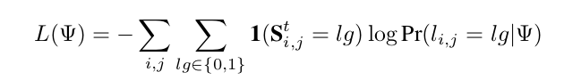

# A Stagewise Refinement Model for Detecting Salient Objects in Images

**2、A Stagewise Refinement Model for Detecting Salient Objects in Images**

1. 我们提出了一种新颖的阶段式细化网络，其中细化网络有助于在粗略显着图中修正尖锐和详细的边界，以进行高分辨率显着对象分割。
2. 采用金字塔池化模块来获取全局上下文信息，其中不同的空间统计提供不同规模的特征表示。

我们提出的显着性检测算法的流水线。 每个绿色框都被视为残留块。

1. 给定输入图像（c），在阶段1中生成具有大小1的中间显着性图（d），其大小为原图片分辨率的1/32。
2. 其次将其向上采样至原始图像大小
3. 然后在第t阶段链接更多的优化网络，去优化前面阶段产生的显著性图。

值得注意的是**金字塔池化模块（PPM）**被连接到 阶段2 的C4 x'以用于不同子区域的表达。

**论文所提方法**

我们提出了一个新的框架，它提供了一个阶段性的细化机制，通过多个细化网络逐步修复更精细的结构。 我们的框架是端到端的训练。 图1显示了所提方法的简化图示。

我们首先描述3.1节中初始粗糙显着图的生成，然后详细描述我们在3.2节中配备金字塔池模块的多阶段细化策略。

**用于粗略预测的前馈网络**

用于图像分类的标准前馈CNN \[42,18\]采用级联的**卷积和池化层**，然后是**全连接层**。

他们将固定空间大小的图像作为输入，并产生指示输入图像的**类别标签的概率向量**。

**卷积层和池化层**控制**模型的能力**并增加**感知域**大小，从而产生粗略的，高层语义的特征表示。

卷积层的输入和输出都是**三维特征图**（a.k.a张量），其中输出特征图是通过将输入特征图上的不同卷积核滑动为下式得到的，

其中X是输入图。 W和b分别表示内核和偏置参数。 \* s表示步幅为 s 的卷积运算。结果，输出特征映射F s（X; {W，b}）的分辨率被因子s下采样。

我们选择最近提出的残差网络（ResNet50）\[18\]作为我们的**基准网络**，因为它具有**卓越的分类性能**，然后我们对其进行修改以满足的要求。与VGG16 \[42\]相比，由于跳过连接和批量归一化层，基于**ResNet-50**的训练过程可以**更快地收敛**。在3.2节描述的后续阶段中，我们还采用ResNet-50作为显着性检测的基本构建块。

**基准网络**将整个图像作为输入，并输出相等分辨率的显着图。 ResNet-50由49个卷积层和5个卷积块组成，后面是平均池化层和一个完全连接层。

为了将其用于我们的密集图像预测任务，我们利用前五个卷积块（第五个块表示为C5 x;遵循相同的约定来表示其他块）以及具有1/32输入图像分辨率的最终特征映射。然后，添加一个具有256个通道的3×3卷积层（Conv6）和一个具有2个通道的3×3卷积层（Conv7）（一个前景掩模，一个用于背景）以计算每个像素的**显着性置信度**。

最后，为了生成与输入图像大小相同的像素预测图，我们通过**双线性插值**直接对低分辨率特征图进行**上采样**，

其中I是输入图像，P是整个网络的输出预测。 F s（·）表示由卷积层生成的输出特征映射，其总步幅为s。 这里省略了偏置项b。 B（·）表示具有参数θ的插值层。

如图1所示，前馈网络可以粗略地定位鸟类和鸟巢，但结果的分辨率很低。 然而，它难以为诸如鸟喙或翅膀的一些图像区域产生像素精确分割。

**多阶段细化网络**

为了缓解上述限制，我们引入了一个多阶段细化过程，该过程试图通过将先前的显着性图与当前阶段中提供的特征相结合来恢复丢失的本地上下文信息。 更具体地，插入金字塔池化层以结合全局上下文信息。

**阶段性优化**

与原始分辨率地面实况相比，由前馈网络生成的第一阶段显着性映射**S 1是粗略的**。因此，在第二阶段，我们采用用于后续优化的**细化网络**，如图1b所示。

我们使用由**ResNet-50**的前四个卷积块（表示为C1'，C2 x'，C3 x'和C4 x'）组成的网络结构，其参数与第1阶段中使用的**参数不同**。这允许更灵活的应对不同的结构，并帮助学习特定阶段的优化。

S1用作后续**并入模块** R1的输入，并且被细化以逐渐增加分辨率。

类似地，在随后的阶段t（t∈{2，...，T}）中，每个合并模块R t-1聚合来自先前粗略地图编码S t-1的信息并输出阶段 t 的细化网络特征F t。

每个模块R t-1将在主通道中生成的编码S t-1的掩码以及在细化通道中生成的匹配特征F t作为输入。

它学会合并信息以生成新的预测编码S t

其中S t-1和S t分别表示第t级输入和输出。

**结构细节**

图2示出了阶段2中采用的**第一细化模块**R 1的详细说明（即，将来自主通道的**粗显着图S 1**与来自细化通道的**特征图F 2**连接）以生成**更精细的显着图S 2** 。

1. 由于S 1（12×12像素）比F 2（23×23）粗超，所以我们首先将S 1上采样到其尺寸的两倍。
2. 然后，我们将上采样显着图与特征图F 2组合以生成S 2。
3. 我们在第四个卷积块（C4 x'）后面追加两个额外的卷积层以减小维数。第一个额外的层有3×3个内核和256个通道，而第二个附加层（输出特征图）3X3内核和64通道。

**金字塔池模块**

上述阶段式细化机制可以逐步编码局部上下文信息以进行更精细的显着性预测。

为了进一步区分显着对象和背景，我们使用**金字塔池模块（PPM**）来收集**全局上下文**信息。 \[17\]率先采用PPM进行深度视觉识别，以摆脱固定尺寸的输入约束，生成固定长度的表示。这是通过连接三级金字塔池功能来实现的。**缺点**是**失去了**对**像素级预测**至关重要的**上下文结构**。作为一种补救措施，\[55\]利用了**空间金字塔池化层**，其中通过平均汇集生成分层特征，并为不同规模的全局特征表示聚合。

在本文中，我们通过将PPM附加到每个细化网络，将PPM应用于每个细化阶段（t&gt; 1）。如图1所示，在2阶段细化网络中，C4 x'特征图被传递到金字塔池模块。

然后，金字塔模块与C4 x'的输出特征映射连接。我们在图4中显示了具有或不具有PPM的3阶段细化网络的视觉比较。

可以看出，使用PPM从所提出的方法生成的显着性图可以保留显着的对象边界并抑制背景噪声。

**架构细节**

金字塔池模块的细节如图3所示.

PPM由**四个尺度的特征箱**组成，分别包括1×1,2×2,3×3和6×6。

1. 可变大小的特征映射包含不同规模的全局信息。 1×1 bin是最粗糙的表示，其由全局池化生成。 具有不同子位置上的汇集表示的较大的箱包含更丰富的全局上下文信息。
2. 此外，具有512个通道的1×1卷积层连接到每个金字塔等级，以减小相应的上下文表示的维度，以维持全局特征的权重。
3. 然后构造上采样层，目的是通过双线性插值获得与C4 x'的输出相同的尺寸特征图，而不是用于限制存储器的反卷积。
4. 最后，将四尺度特征连接为最终的金字塔池化聚合特征。

**训练**

我们使用**标准随机梯度下降算法（SGD）**来训练网络的所有T级端到端。

为了在所有后续阶段共享特征，我们在阶段t≥2之间共享相应卷积层的权重。

通过训练，让框架的每个阶段基于前一个阶段重复地生成显着性图，并且恢复和添加更多细节。

我们鼓励网络在每个阶段t（t &lt;T）的输出处应用辅助损失函数来重复地达到这种表示。

**主要和辅助损失都有助于共同优化学习过程。**

具体来说，我们首先将每个阶段生成图上采样到Ground-truth 大小（在每个阶段后面的主分支中实现）。

然后，S t和地面实况显着性掩模G之间的逐像素交叉熵损失计算如下：

其中1（·）是指标功能。 符号lg∈{0,1}表示位置（i，j）处的像素的前景或背景标签，Pr（l i，j = lg）表示这个位置是显著性物体的可能性，Ψ 表示网络的所有层的参数。

我们将主要和辅助损失相结合的最终损失函数可写为：

其中我们设置λt= 1来平衡所有损失。

辅助损失分支仅在训练过程中使用。 它们在最终像素预测中被抛弃。 我们只是将固定大小的输入图像提供给网络，以生成最终的显着图，而无需使用任何预处理或后处理。

观察期网络结构发现：

网络是依托于resnet50建立的，然后，在resnet50的基础上，将

