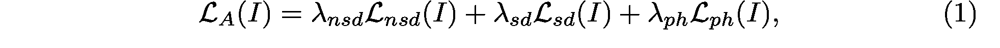
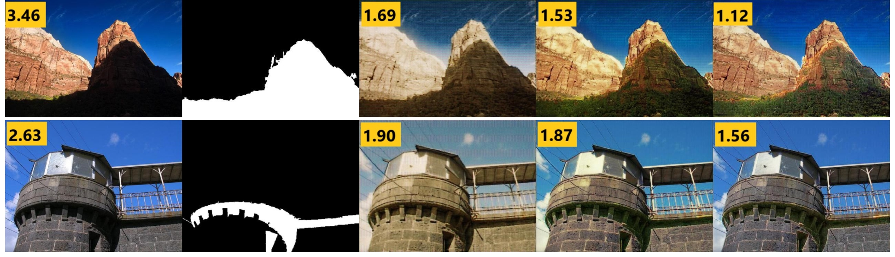
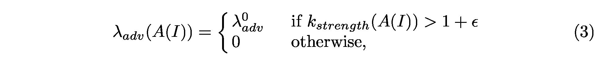
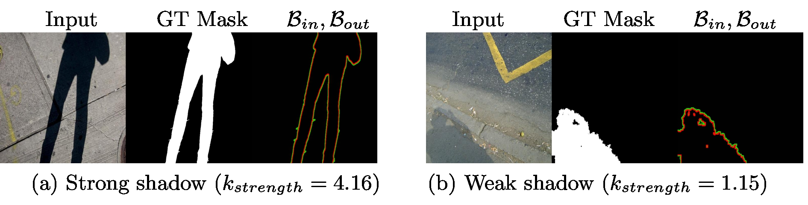

# A+D Net: Training a Shadow Detector with Adversarial Shadow Attenuation

**A+D Net: Training a Shadow Detector with Adversarial Shadow Attenuation**[For shadow detection.note](note://WEBff9743f5794c7422fea520c6f977c314)

**摘要**

我们提出了一种新的基于GAN的框架，用于检测图像中的阴影，其中阴影检测网络（D-Net）与阴影衰减网络（A-Net）一起训练，生成对抗性训练示例。A-Net修改了受简化物理阴影模型约束的原始训练图像，并专注于欺骗D-Net的阴影预测。因此，它有效地增加了具有难以预测的案例的D-Net的训练数据。训练D-Net以预测原始图像中的阴影和来自A-Net的生成图像。我们的实验结果表明，来自A-Net的额外训练数据显着提高了D-Net的阴影检测精度。我们的方法在最具挑战性的阴影检测基准（SBU）上优于最先进的方法，并且还在跨数据集任务上获得最先进的结果，在UCF上进行测试。此外，所提出的方法以每秒45帧的速度实现精确的实时阴影检测。

**1、简介**

在本文中，我们提出了一种方法来最大限度地提高可用影子数据的效用，而不是收集额外的数据。

主要思想是通过削弱原始训练图像中的阴影区域从单个阴影图像生成一组增强训练图像。我们将此过程称为阴影衰减，我们训练深度神经网络，称为A-Net。该网络修改原始阴影图像以减弱阴影效果，如图1所示。生成的图像用作阴影检测器D-Net的附加挑战性训练样本。

**我们提出了一种新颖的框架**，其中阴影衰减器和阴影探测器以对抗方式联合训练。衰减模型A-Net的输出提供具有难以检测的阴影区域的对抗训练样本，以提高检测器D-Net的整体可靠性。

最近的研究还表明，深层网络对**对抗性扰动高度敏感**\[19,26,34\]。通过联合训练A-Net和D-Net，我们直接增强探测器D-Net对抗对抗条件的能力，并根据最近的趋势\[35,3,31\]改进探测器的推广。

基本上，这里提出的是**用于阴影检测的数据增强方法**。

它与**其他数据增强方法**不同，它不受一般数据增强方法的**两个固有问题的影响**，它们是：

1）增强数据可能与实际数据非常不同，对分类器在真实数据上进行训练的泛化能力没有影响，

2）确保增强数据样本与原始数据具有相同的标签是极其困难的，这会导致训练标签噪声。

解决这些问题的流行方法**是约束增强数据样本接近原始数据**，例如，设置原始样本和生成样本之间L2距离的上限。

然而，设置正确的界限是很难的; 较大的值会产生标签噪声，而较小的值会产生与原始数据过于相似的增强样本，不会产生任何好处。在本文中，我们以原则的方式解决这两个问题，特别是阴影检测。我们的想法是使用阴影和光照的物理模型来指导数据生成过程并估计出有标签噪声的概率。

请注意，我们的目标是**衰减阴影区域**，而**不是去除阴影区域**。阴影去除是一个重要的问题，但是训练一个好的阴影去除网络将需要许多训练对的相应阴影/阴影图像，这是不可用的。此外，完全去除的阴影将对应于具有标签噪声，这可能会损害检测器的性能。实验结果表明，我们的阴影探测器在挑战性阴影检测基准SBU \[30\]以及跨数据集任务（SBU训练和UCF数据集测试\[36\]）上优于最先进的方法。

此外，我们的方法比许多现有方法更有效，因为它**不需要后处理步骤**，例如块平均或条件随机场（CRF）平滑。我们的方法检测256×256输入图像的每秒45帧的阴影。

**2、相关工作**

我们提出了一种方法，通过增强的训练样例来改进阴影检测，与最近的数据增扩趋势同步。

例如，张等人。 \[35\]提出了一种简单的增强方法，将数据集通过**实例对及其标签**的**线性组合**进行丰富，以改善网络的泛化及其对**对抗性例子**的一致性。

Shrivastava等人提出了另一种使用对抗实例来训练网络的方法。 \[24\]。他们对抗训练了一个Refiner网络，输入合成示例并输出更逼真的图像。重新定义的示例可用作附加训练数据。

以类似的方式，我们提出的衰减器（A-Net）**采用原始训练图像**并**生成具有衰减阴影的逼真图像**，作为我们的阴影探测器的附加训练示例。与\[24\]相比，对抗性示例的生成是与检测器（D-Net）的联合训练过程的组成部分，其中生成的数据是丰富训练集的预处理步骤。阴影衰减器的效果也可以看作与对抗性扰动有关\[18\]：A-Net修改输入图像以欺骗阴影探测器D-Net的预测。对抗性示例也可用于改进用于域自适应的网络的泛化\[31\]，其中条件GAN用于执行特征增强。

**3、对抗性训练和衰减**

**3.1框架概述**

我们提出了一种基于对抗训练和阴影衰减的阴影检测新方法。我们提出的模型包含**两个共同训练的深度网络，**图2说明了我们框架的流程图。

**阴影衰减网络**，称为衰减器或**A-Net**，将**阴影图像及**其相应的**阴影遮罩视为输入**。基于这些输入，衰减器**生成输入图像的一个版本**，其中**阴影已经衰减**。衰减可以被认为是部分阴影去除。

由衰减器生成的图像被馈送到**阴影检测网络**，称为检测器或**D-Net**，它**预测阴影区域**。在每次训练迭代中，D-Net也采用原始输入图像，并学习预测相应的带注释的真实阴影掩模。

训练A-Net衰减阴影区域以欺骗阴影探测器。

特别地，对于所提供的阴影掩模内的像素，A-Net操纵像素的值以将它们**伪装成非阴影像素**，**使得它们不能被D-Net识别**。

我们**使用包含物理启发的阴影域知识**的损失进一步**约束衰减变换**。这提高了生成像素的质量，改善了检测器的普遍性。

同时，A-Net学会**不改变阴影掩模之外的值或像素**。我们通过一种损失强制执行此操作，该损失会影响生成的图像与阴影遮罩外部区域（非阴影像素）上的输入图像之间的差异。

具有所有上述约束的对抗训练过程和来自阴影检测网络的反向传播误差引导A-Net执行阴影衰减。

**探测器网络D-Net**采用A-Net生成的对抗性示例并预测阴影掩模。A-Net生成的图像中的阴影区域通常比输入图像更难以检测，因为A-Net经过训练可以减弱阴影以欺骗D-Net。因此，除了原始训练示例之外，D-Net还接受了具有挑战性的示例的训练。随着DNet提高其检测阴影的能力，A-Net还提高了衰减阴影的能力，使D-Net与更强硬的对抗性例子相混淆。这个过程增强了D-Net的阴影检测能力。

**3.2 基于物理的阴影和照明模型**

我们使用**基于物理的照明模型**来指导数据生成过程并避免标签噪声。我们使用Guo等人使用的简化照明模型\[7,8\] 。其中，每个像素由**直接光和环境光**的组合点亮：

I\_i = \(k\_i \* L\_d + L\_e \) \* R\_i 其中

I是图像，

I\_i 表示图像的第i个**像素**的**颜色**。

R\_i是与第i个**像素**对应的**表面反射率**。

L\_d 和 L\_e 分别是3×1矢量，分别代表**直射光**和**环境光**（它们模拟**区域光源**和**相互反射**）的**颜色**和**强度**。

k\_i ∈ \[0,1\]是**阴影因子**，表示有**多少直接光**到达像素 i 。k\_i 对阴影的**本影**区域保持接近**0**，而在**半影区**域中它越来越接近**1**。对于无阴影区域内的像素 k\_i = 1。

我们可以通过比率将原始阴影区域及其相应的无阴影版本关联起来：

通过采用无阴影和阴影值之间的比率，我们消除了未知的反射因子。我们假设直射光在图像描绘的场景上是恒定的，并且**环境光**的效果**对于所有像素是相似的**。我们将此模型纳入A-Net和D-Net的培训过程：

A-Net: 我们设计了这些基于物理的loss来使阴影衰减区域像素的方差更小。

D-Net: 我们直接估算阴影遮罩内外区域的照度比，以测量衰减图像中的阴影强度，以避免训练标签噪音。

_图3：A-Net。阴影掩模之外的区域受到相对于输入图像的差异损失的约束。阴影掩模内的区域受到来自D-Net和基于物理的约束的反馈的约束。_

**3.3 A-Net：影子衰减器网络**

阴影衰减器网络A-Net被训练为仅**重新照亮阴影区域**，**使**得它们**不能被检测器网络D-Net检测到**。

为了获得有用且逼真的衰减阴影，A-Net的目的是在**尊重物理照明模型的同时欺骗D-Ne**t。图3显示了A-Net的训练过程，它在以下约束和目标下衰减阴影区域：

1）保留非阴影像素的值。

2）重新照亮阴影像素，使得D-Net无法将它们识别为阴影像素。

3）得到的像素变换服从物理启发的照明约束。

**通过定义适当的损失函数，可以将这些约束和目标结合到A-Net的训练中**。

让I表示输入图像，M\(I\)是I的阴影掩模。

设**A\(I\)** 表示以 I和M\(I\)为输入对 的 **A-Net 输出**（这里我们将A\(I\)写作为 A\(I,M\(I\)\) 的简写形式）。

令**D\(I\)**表示输入图像 I 的 **D-Net 输出**，即**预测**的**阴影掩模**。理想情况下，**阴影像素的输出应为1**，否则为0。

A-Net 培训的目标是最大限度地减少三种损失的**加权组合**：

L\_nsd是对输入图像I的**阴影掩模 M\(I\) 之外**的像素的值进行修改的损失 :

L\_sd是对抗性损失。**它惩罚了生成图像上被D-Net正确识别的阴影像素**，仅限于训练**阴影掩模 M\(I\) 内**的区域:

L\_ph 是一种物理启发性的损失，可确保生成图像中的阴影区域**以物理可行的方式重新照明**。基于3.2节中描述的照明模型，我们希望比率A\(I\)\_i/I\_i对于重新照明阴影区域内的所有像素i是相似的。我们通过为**对数比的方差**添加损失项来对此进行建模 :

其中\(·\)^c表示RGB彩色图像的颜色通道c中的像素值。

图4示出了在对抗训练过程中由A-Net产生的衰减阴影的一些示例。两个原始输入图像包含易于检测的阴影，强度为3.46和2.63。第3.4节描述了测量这些阴影强度值的启发式方法。给定这些输入图像和阴影掩模的A-Net的输出显示在列（c，d，e）中，在训练期间在时期1,5和40获得。随着训练的进行，生成的图像中的阴影变得更难以检测。在数值上，衰减阴影的阴影强度随时间降低。此外，A-Net还学会不改变非阴影区域。

 _**对抗性实施例**_

_（a）输入 （b）GT （c）时期1 （d）时期5 （e）时期40_

_**图4：衰减阴影的例子**。 （a）输入图像。 （b）地面实况阴影面具。_

_（c，d，e）：分别由时代1,5和40由A-Net产生的具有衰减阴影的对抗性示例。相应的阴影强度在每个图像的左上角显示为黑色文本。_

**3.4 D-Net：暗影探测器网络**

**D-Net是我们框架的核心**。它学习如何检测由A-Net生成的对抗性示例的阴影以及原始训练示例。在每次训练迭代时，原始输入和对侧衰减图像用于训练D-Net。 D-Net的学习目标是最小化以下损失函数：

其中 λ\_real 和 λ\_adv\(A\(I\)\)控制 D-Net 应分别从实际样本 I 和对抗性示例A\(I\)中学到多少。 **λ\_adv\(A\(I\)\)**取决于我的阴影衰减了多少。

如果A\(I\)是 I 的完全无阴影版本，λ\_adv\(A\(I\)\)理想情况下应为零。否则，该损失函数对应于具有标签噪声，因为它需要阴影检测器 D-Net对于输入A\(I\) 的输出与 阴影掩模 M\(I\)相同，而这里A\(I\)是阴影去除图像 。（翻译：也就是说当A\(I\) 是 I 的完全去除阴影的结果时候，λ\_adv\(A\(I\)\)应当为 0，不然的话，此时对于无阴影的输入A\(I\) D-Net 的输出也和 M \(I\) 一致，那么loss函数对应与具有标签噪声）

为了确定A\(I\)是否是无阴影图像，我们基于3.2节中描述的照明模型推导出一种启发式算法 。

我们首先在阴影边界旁边定义了两个区域，表示为 **B\_in** 和 **B\_out**，如图5所示。**B\_out**（绿色）是边界外的区域，通过从其扩张版本中减去阴影蒙版来计算。内部区域 **B\_in** （红色）与被侵蚀的阴影掩模类似地计算。

我们将阴影强度k\_strength定义为两个边界区域的平均像素强度的比率：k\_strength\(A\(I\)\)=mean\_i∈Bout \[A\(I\)\_i\]/mean\_i∈Bin \[A\(I\)\_i\]

图5显示了具有两个不同阴影强度的图像示例，其中阴影较暗的图像 kstrength的值较高，反之亦然。

我们使用**衰减图像的阴影强度**来确定**D-Net是否应该从衰减的阴影图像中学习**。如果阴影强度 **k\_strength 太接近于1**，即阴影边界两侧的两个区域具有相同的平均强度，则启发式地认为阴影已经被完全去除（此时设置 λ 为0 ，就是说不再从衰减图像中学习）。基于这种启发式，我们为对抗性示例设置权重A（I）如下：

其中λ^0\_adv是对抗性实例的可调基线因子，_e_ 是一个小阈值，我们根据经验设置为0.05。

_**图5：估计阴影强度**。从地面实况阴影掩模中，我们定义了通过阴影掩模的扩张anderosion获得的两个区域 B\_out（红色）和 B\_out（绿色）。阴影强度 k\_strength 计算为 B\_out 中像素的平均强度与 B\_out 中像素的平均强度之间的比率。_

_（a）强烈暗影的图像， k\_strength  = 4.16。_

_（b）弱影 k\_strength  = 1.15。_

**3.5 网络架构**

A-Net 和 D-Net 都是基于U-Net架构开发的\[23\]。根据\[12\]，我们创建了具有七个跳过连接模块的网络，每个模块包含一系列卷积，BatchNorm 和 Leaky-ReLu \[9\] 层。

A-Net **输入是四通道图像**，它是**RGB**图像和相应**阴影掩模**的串联。

A-Net **输出是三通道RGB**图像。

D-Net 的输入是RGB图像，输出是单通道阴影掩模。

**4、实验和结果**

**培训和实施细节**。

我们使用随机梯度下降与Adam解算器\[14\]来训练我们的模型。

我们使用批量大小为64的mini batch SGD。

在每次训练迭代时，我们连续执行三次前进：将输入阴影图像I转发到A-Net以获得对抗性示例A（I），然后分别转发对抗性图像和阴影输入图像到D-Net。

我们**交替**在D-Net上进行一个参数更新步骤，在A-Net上进行一个更新步骤，如\[6\]中提到的。

在训练和测试之前，我们将图像**转换为对数空间**。我们通过实验将训练参数设置为：（λ\_nsd，λ\_sd，λ\_ph，λ\_real，λ^0\_adv）:=（30,1,100,0.8,0.2）。

我们在PyTorch上实现了我们的框架。更多详细信息，请访问：www3.cs.stonybrook.edu/~cvl/projects/adnet/index.html

