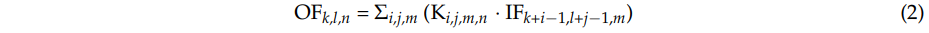

# Convolutional Neural Network-Based Shadow Detection in Images Using Visible Light Camera Sensor

**6. Convolutional Neural Network-Based Shadow Detection in Images Using Visible Light Camera Sensor**

应用场景：固定视角的监视器视频场景中

基础模型：VGG16

1. This is the first CNN-based approach to shadow detection.

 2. We convert input image of red-green-blue \(RGB\) color into that of hue-saturation-value \(HSV\) coordinate to remove the effect of hue channel which causes the error of shadow classification. As the input to CNN, we use an image of three channels including the saturation and value images of input, and the ratio image of value images of input to background.

3. The searching region including a rough area of foreground and shadow is determined by background subtraction. To reduce the processing time, only the 21 × 21 sliding window extracted from this s earching region is used for the input to VGG Net-16 model.

4. We open our CNN model trained in this research and the experimental database in \[7\], so that other researchers can perform a fair comparison.

1.这是第一个基于CNN的方法来阴影检测。

2.我们转换的红 - 绿 - 蓝（RGB）彩色图像输入到该色调 - 饱和度 - 值（HSV）坐标，以除去导致阴影分类的误差色调信道的效果。

作为输入到CNN，我们使用三个通道包括饱和和输入的值的图像，和输入的值图像背景的比值图像的图像。

3.包括前景和阴影的粗糙区域的搜索区域通过背景减法来确定。为了减少处理时间，仅从这个搜索区域中提取的21×21的滑动窗口用于输入到VGG的Net-16模型。

4.我们的这项研究是开源的，并在\[7\]，从而使其他研究人员能够进行公平的比较实验数据库训练的CNN模型。

**3. Proposed Method**

**3.1. Overall Procedure of Proposed Method**

在图1中，我们显示了我们方法的总体流程图。 在第一步骤中，使用背景图像通过背景减法检测前景区域。 然后，从检测到的前景区域中提取具有21×21像素大小的窗口图像。 在将提取的窗口图像大小调整为224×224像素大小之后，将其输入到预先训练的CNN中。 然后基于CNN的输出检测阴影区域。 在这项研究中，我们使用VGG Net-16作为CNN，后者使用ImageNet数据集\[25,26\]进行了预训练。 在测试之前，使用本研究中使用的实验数据进行进一步微调。

**3.2. Extraction of Window Image for CNN Input**

在通过背景减法获得前景区域之后，如图2b所示，非阴影（即人）和阴影区域被手动分离为CNN训练的地面实况区域，如图2c所示。也就是说，通过观察人类显影剂将图2b的白色像素中的阴影像素手动涂成红色，并且剩余的白色像素自动转换成蓝色像素，如图2c所示。这是地面实况数据，它用于CNN训练并测量我们实验中阴影检测的准确性。详细地，基于地面实况区域的位置，从图2a的原始输入图像中提取21×21像素的窗口图像。例如，其中心属于图2c的蓝色区域的窗口被确定为非阴影区域。然而，其中心属于图2c的红色区域的窗口被确定为阴影区域。从HSV颜色空间的输入图像中提取21×21像素的窗口图像而不是RGB颜色空间。现有研究假设阴影使背景变暗但保留其颜色，而人体图形的色度显示出更加多样化的背景变化\[8,15\]。基于\[8\]的结果，我们通过实验确定HSV颜色空间最适合表示阴影特征。因此，输入和背景图像被转换为​​HSV颜色空间。如果从RGB颜色空间变换到HSV颜色空间的输入和背景图像分别是I和B，则创建的窗口图像Fk，i（x，y）的每个通道值由等式（1）定义。

其中，Fk，i（x，y）是第k个图像帧中的第i个窗口图像，F 1 k（x，y），F 2 k（x，y），F 3 k（x，y）各自 Fk的通道图像，i（x，y）。 Ik（x，y）和Bk（x，y）分别是输入图像和背景图像。 s是饱和度，v是HSV中图像的强度。 生成的窗口图像的尺寸是21×21×3（即，宽度×高度×通道），并且提取使用x，y标称坐标。 从训练数据中提取的窗口图像用于CNN训练。 如图2b所示，通过背景减法从测试数据中提取的窗口图像被用作CNN的输入。 通过该方法，非阴影区域和阴影区域彼此区分。

**3.3. VGG Network for Classifying Non-Shadow and Shadow Regions**

图3和表2显示了本研究中使用的VGG Net-16 \[25\]的总体架构。 VGG Net-16共有16层，包括13个卷积层和3个完全连接层（FCL）。 每个卷积层连接到整流线性单元（ReLU）层。 我们对网络进行微调，这是通过ImageNet数据集预先训练的\[27,28\]。 更多细节将在第4节中介绍。

该CNN的初始图像尺寸为224×224×3。因此，如3.2节所述，我们进行双线性插值以将从HSV颜色空间获得的三通道21×21窗口图像调整为三个 - 通道224×224图像，用作CNN的输入。 在第一卷积层中，使用64个尺寸为3×3×3的滤波器。 第一卷积层中的特征映射大小为224×224×64，因此224和224分别是输出高度和宽度，基于（输出高度（或宽度）=（输入高度（或宽度） - 过滤器计算） 高度（宽度）2×（填充数））

在等式（2）中，IFk i-1，lj-1，m是尺寸的输入特征图，AF·AF·U.AF是方形输入特征图的宽度和高度，U是输入通道的数量。 （即输入深度）。 OFk，l，n是尺寸的输出特征图，BF·BF·V.BF是方形输出特征图的空间宽度和高度，V是输出通道的数量（即，输出深度）。 在等式（2）中，Ki，j，m，n是大小的卷积核，AK·AK·U·V，并且AK是卷积核的空间维度。 然后，标准卷积采用以下计算成本。

C = AK · AK · U · V·AF · AF \(3\)

基于方程（2），我们发现计算代价依赖于乘以内核大小，AK·AK，U的输入通道数，V的输出通道数和输入特征映射大小，AF ·AF \[30\]。 通过上面的等式计算图像，并将结果输入下一层。 如等式（4）所示，每个卷积层连接到ReLU层，其具有非饱和非线性，并且比具有饱和非线性的激活函数更快。 例如，f（x）= tanh（x）和f（x）=（1 e -x）-1等，因此，它可以消除训练时反向传播中的消失梯度问题\[31，32。 在\[27\]中，他们表明ReLU使用基于四层CNN的CIFAR-10数据集的训练速度比具有相同数据集和网络的tanh（x）函数快六倍。

y = max\(0, x\), \(4\)

其中x和y分别是ReLU函数的输入和输出值。如表2所示，通过在第一卷积层经过第二卷积层和另一个ReLU之后的最大合并层之后进行ReLU而获得的特征图。这里，与第一卷积层一样，第二卷积层应用相同的滤波器高度和高度3×3，填充1×1和步幅1×1，并且保持特征映射大小224×224×64。在表2中清楚的是，13个卷积层通常使用3×3的滤波器尺寸（即，宽度和高度）和1×1的填充，从而保持特征图尺寸（即，宽度和高度）。只有滤波器的数量变为64,128,256和512.每个ReLU层连接到每个卷积层的背面，并且在通过卷积层之后保留特征映射大小。在具有ReLU的第2，第4，第7，第10和第13卷积层之后，连接最大汇集层。最大池层使用指定大小的过滤器中的最大值，并执行一种子采样工作。

在使用ReLU的第二卷积层之后，当最大池层操作时，输入特征映射大小为224×224×64，滤波器大小为2×2，并且步幅数为2×2。当步幅数量时它是2×2，它意味着最大池化滤波器为2×2。即，在水平和垂直方向上存在像素移动。因为在滤光器移动期间没有重叠区域，所以特征图尺寸减小到1/4（即宽度的1/2和高度的1/2）。最终，通过最大合并层的特征地图大小变为112×112×64像素。如表2所示，该最大汇集层在每种情况下由2×2的滤波器和2×2的步长组成。因此，特征图尺寸减小到1/4（即宽度的1/2和高度的1/2）。在通过13个卷积层，13个ReLU层和5个最大池层之后，最终的特征映射大小变为7×7×512像素，并且映射通过另外三个FCL。第一，第二和第三FCL的输出节点分别为4096,4096和2。

通常，CNN具有过度拟合的问题，其中网络过于依赖于训练数据。 虽然训练数据的准确性仍然很高，但是这个问题会导致测试数据的识别准确度低。 为了解决这个问题，我们使用了丢失方法\[27,33\]，它可以减少过度拟合问题的影响。 对于丢失方法，我们使用50％的丢失概率来断开前一层与第一和第二FCL中的下一层的连接。 在第三个FCL之后，通过使用SoftMax层计算非阴影和阴影的概率，如等式（5）所示。

假设输出神经元阵列设置为s，我们可以通过将第j个元素的值除以所有元素的值的总和来获得属于第j个类的神经元的概率。 由于本研究中仅存在两类非阴影和阴影，因此第三个FCL之后的分类层输出为2。

