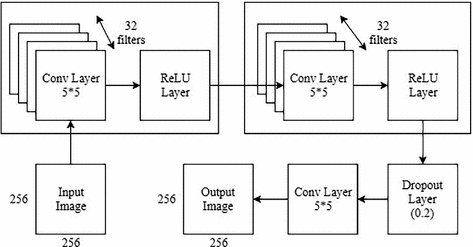

# Deep Learning Based Shadow Detection in Images

**5. Deep Learning Based Shadow Detection in Images**

**相关工作：**

* **基于几何的方法**通过利用诸如相机位置，背景场景和光源位置之类的几何信息来检测阴影。 Chen等人提出的三阶段算法。 \[3\]用于垂直构成的行人的阴影检测。首先，检测阴影特征支持向量机训练并应用于前景伪装。然后，通过线性分类器将前景伪装划分为阴影子区域和人类。在最后阶段使用2D高斯滤波器在背景区域的帮助下重建阴影区域。 Hsieh等人提出了一种粗到细的阴影去除方法。 \[4\]。在粗略阶段使用moment-based技术，用于估计运动物体和阴影之间的粗糙边界。通过高斯阴影建模，在精细阶段进一步计算阴影区域的近似。
* **使用基于色度的方法**的算法尝试使用适当的颜色空间来描绘阴影出现时像素值和外观的差异。 Cucchiara等。 \[5\]在阴影识别中使用了色相饱和度值（HSV）色彩空间。通过计算帧的HSV分量和所引用的背景的变化率来检测阴影。陈等人。 \[6\]提出了YUV颜色空间方法来获得亮度信息并保持色度分量完整用于阴影检测。这些技术易于执行，但容易产生噪音，不适用于强阴影。
* **基于物理的方法**根据反射和照明对阴影点的特定外观进行建模。 Huang等人使用基于物理的颜色特征来检测阴影。 \[7\]在室外和室内环境中。当物体具有类似于背景的色度时，物理方法不会产生良好的结果。
* **基于边缘的方法**在检测阴影时非常有用，因为边缘在变化的照明下不会变化。 Panicker等人。 \[8\]使用Sobel算子提取前景和背景掩码。然后将这两个边缘图相关联以保留对象的内部边缘。最后，应用垂直和水平操作来重建物体形状。为了检测室内序列中的阴影，Xu等人。 \[9\]提出了一种静态边缘相关方法。在该方法中，生成了变化检测掩模（CDM）并且应用了精确边缘检测来检测阴影区域。
* **基于纹理的方法**通常应用两个步骤：（i）借助弱阴影检测器选择阴影点，然后（ii）基于纹理相关性将这些候选者分类为对象或阴影。 Sanin等人提出的技术。 \[10\]利用颜色特征识别阴影区域，然后应用渐变纹理相关性将它们与对象区分开来。张等人。 \[11\]提出了一种不同的算法，用于检测在比率边缘上建立的阴影，假设比率边缘是不变的照明。由于基于纹理的方法必须为每个像素计算不同的邻域评估，因此它们通常很慢。

参考意义不大

