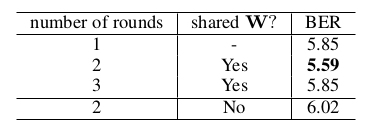

# Direction-aware Spatial Context Features for Shadow Detection and Removal

**1、Direction-aware Spatial Context Features for Shadow Detection and Removal**

**论文中的网络架构**

论文整体架构方法：

1. 论文首先使用CNN提取不同尺度下的特征图，这里的CNN作者用的是VGG
2. 其次，作者采用了DSC模块来对每一层的特征图进行处理，得到拥有各个方向信息的DSC特征
3. 将得到的特征图进行串联，其次将其向上采样至输入图像尺寸。
4. 更进一步的，利用**1X1的卷积层**将向上采样的**特征**整合成**多层级的整合特征MLIF**，同时应用深度监督机制\(deep supervision mechanism\)\[29\]将监督信号强加给每一层以及MLIF，并为每一层预测一个阴影掩模。
5.  最后，将所有预测的阴影掩模**融合**到最终的阴影检测输出中。

**利用RNN提取方向性空间内容的特征，**

在两轮数据转换之后，每个像素可以获得必要的全局空间上下文，用于学习特征并解决网络所针对的问题。

其中，执行空间循环RNN的步骤参照的是 IRNN model\(A simple way to initialize recurrent networks of rectified linear units\)，由于其优异的性能以及在长距离数据的优异性能表现。

h i,j 是像素点 \(i, j\) 位置的特征 。

通过将上述式子执行 n 次，来完成一个回合的数据传输，其中，n为特征图的宽度，α right 是右向循环传播的权重参数，其在训练的时候被初始化为单位矩阵，然后自动学习。

**DSC模块的网络架构**

这里用到了**方向感知注意机制**的目的是使空间RNN能够通过学习选择性地利用沿不同方向聚合的空间上下文。

1. 首先，参见图4所示的DSC模块中的左上方块，使用两个连续的卷积层（3×3），然后是ReLU \[36\]非线性操作，然后是第三个卷积层\(1×1\)生成W。
2. 然后，我们将W分成四个**注意力权重图**，表示为W\_left，W\_down，W\_right和W\_up。我们将上述运算符表示为f\_att, 并且输入要素映射为X, 得到 W = f\_att\(X;θ\)，其中θ表示f\_att要学习的参数，而f\_att是也称为**关注度估算网络**。
3. 再次参见图4中所示的DSC模块。四个权重图以元素方式沿着不同方向与空间上下文特征（来自循环数据转换）**相乘**。因此，在我们训练网络之后，网络可以学习θ以产生合适的注意权重以选择性地利用空间RNN中的空间上下文。
4. 我们串联这些结果，并使用1×1卷积来模拟 **隐藏层到隐藏层** 的数据转换，并将得到的特征图的尺寸减小到维度大小的四分之一。
5. 然后，我们执行第二轮**循环数据转移**并使用同样的注意力权重来**提取空间内容**。作者发现，当分享注意力权重而不是使用两组独立的权重时，网络可以提供更高的性能。请注意，这些注意力是基于从输入图像中提取的深度特征来学习的，因此它们可能因图像而异。
6. 最后，我们使用**1×1卷积**，然后在**串联的特征映射**上使用ReLU 非线性运算，来模拟**隐藏层到输出层**的转换并生成输出DSC特征。

**训练：**

**损失函数：**

在自然图像中，阴影通常占据图像空间中比非阴影区域更小的区域。 因此，如果损失函数仅仅针对整体精度，则倾向于匹配具有更多像素的**非阴影区域**。 因此，我们使用**加权交叉熵损失**来优化训练过程中的阴影检测网络。 详细地，假设像素的地面实况值是y（其中y = 1，如果它在阴影中，并且y = 0，否则）并且像素的预测标签是p（其中p∈\[0,1\] \]）。 加权交叉熵损失L等于L 1 + L 2：

1. TP和TN是真阳性和真阴性的数量，
2. Np和Nn分别是阴影和非阴影像素的数量，Np + Nn是图像空间中的像素总数。

**L1有助于平衡阴影和非阴影的检测;**

如果阴影区域小于非阴影区域的阴影区域，我们将比错误分类的非阴影像素更多地惩罚错误分类的阴影像素。

**L2帮助网络专注于学习难以分类的类（阴影或非阴影）**\[38\]。

因为当正确分类的阴影（或非阴影）像素的数量小时，阴影（或非阴影）类的损失函数中的权重很大，反之亦然。

我们对图1所示的阴影检测网络中的每一层使用上述损失函数。因此，整体损失函数L total是不同尺度上**所有**预测阴影**掩模上**的个体**损失的总和**：

1. wi和L i分别表示整个网络中第i层（级别）的权重和损失;
2. w m和L m是MLIF层的重量和损失;
3. w f和L f是融合层的权重和损失，它是整个网络中产生最终检测结果的最后一层;
4. 所有权重w i，w m和w f均根据经验设置为1。

**训练参数。**

1. 为了加速训练过程，同时减少过度拟合，我们通过训练有素的VGG网络\[37\]和其他层中的随机噪声参数初始化特征提取层中的参数（参见图1中网络的前部）。。
2. 随机梯度下降 SGD 用于优化整个网络，momentum值为0.9，weight decay为5×10 -4。
3. 我们将learning rate设置为10 -8，并在12k迭代后终止学习过程。
4. 此外，我们水平翻转图像进行数据论证。
5. 请注意，我们在Caffe \[39\]上构建模型，其中mini-batch size大小为1，并在每10次训练迭代中更新模型参数。

**测试**

1. 在测试过程中，我们的网络为每一层产生一个阴影掩模，包括MLIF层和融合层，并在每层添加一个监督信号。
2. 之后，我们计算MLIF层和融合层上的阴影掩模的平均值，以产生最终的预测结果。
3. 最后，我们应用全连接的条件随机场（CRF）\[40\]，通过考虑邻域像素之间的空间相干性来改善检测结果。

**成分分析。**

我们进行了一项实验来评估DSC模块设计的有效性。 在这里，我们使用SBU数据集并两个基准网络。 第一个基准（表示为“基本”）是通过从图1中所示的整个网络中移除所有DSC模块而构建的网络。

第二个基准（表示为“基本上+下文”）考虑空间上下文但忽略方向感知注意权重。 与第一个基线相比，该网络具有所有DSC模块，但它消除了DSC模块内部的方向感知注意机制，即，去除W的计算并直接连接上下文特征而不将它们与注意权重相乘; 参见图3.这相当于将所有注意力W设置为1。

**DSC架构分析。**

在使用DSC模块设计网络结构时遇到两个问题：

（i）空间RNN中循环传播的次数;

（ii）是否在不同轮次的经常性传播中分享注意力权重或使用单独的注意力权重。

我们修改了这两个参数的网络，并产生了表3中所示的比较结果。

从结果中，我们可以看到，进行**两轮循环传播**并**共享注意权重**会产生**最佳结果**。

我们认为，当只有一轮循环翻译时，全局背景信息不能在空间域上很好地传播，因此没有足够的信息交换来学习阴影，同时有三轮循环翻译，具有单独的注意权重副本将引入过多的参数，使网络难以训练。

**特征提取网络分析。**

我们进行了一项实验来评估特征提取网络，如图2所示。我们使用更深层次的网络，ResNet-101 \[45\]和101层，来取代仅有16层的VGG网络。

考虑到ResNet-101，我们使用res2c，res3b3，res4b22和res5c来生成不同比例的DSC功能，并保持其他网络部件和参数设置不变。

我们获得的VGG网络和ResNet-101的BER值分别为5.59和5.73，表明它们具有相似的性能。

更深层次的网络提供了更强大的语义功能，但是当考虑到有限的GPU内存时，由于小尺寸的特征映射而丢失了详细信息。

