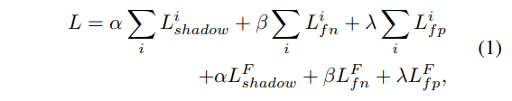
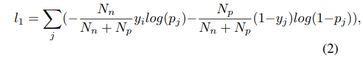

# Distraction-aware Shadow Detection

**11、Distraction-aware Shadow Detection （CVPR19）**

**introduction**

在这篇文章中，我们将这些模糊语义区域称为distraction，并且考虑两类distraction：1，FP（预测错误，预测值真，即像阴影的非阴影区域），FN（预测错误，预测值假，即像非阴影区域的阴影），由于大部分的文章在这些容易出错的特征上没有进行特别关注，采用相同的权重去训练这些特征，因此，需要很大的数据量才能学习到提取出这些不明显特征的方法，所以现有的方法多半没有太好的表现。

假设利用潜在的语义模糊区域的语义信息会帮助加速阴影检测性能的提升。

首先提取 FND 和 FPD 特征，然后将这些特征根据特征类型分别进行整合。

具体的，由于FND通常有着与普通阴影不同的可变视觉外观，因此其很难被检测到，因此使用注意力机制去选择这些潜在FN区域周围的特征，并将其加入到输入图片里面，从而来获得FN增强的特征，进一步加强模型对于FN的区别能力。

另一方面，FPD通常和阴影区域有着局部相似的特征，因此需要一个更加宽广的上下文信息来捕捉其特征，因此，我们采用了卷积层来获得具有 更大感受野的 FP感知特征，然后从FN增强特征中减去这些特征，从而使得模型不受FP影响。

 将DS模块插入到多尺度框架中以提取不同尺度的分散感知阴影特征以预测阴影检测图。

**主要贡献**

首先，我们将distraction的概念引入阴影检测问题，允许更准确地检测阴影。

其次，我们提出了一个distraction感知的影子模块，将distraction语义集成到我们的端到端多尺度影子检测框架中。

**相关工作**

在几个视觉任务中已经探索了Distraction因素，例如语义分割\[13\]，显着性检测\[1,38\]和视觉跟踪\[43\]。 现有的工作采用Distraction线索来过滤掉分散注意力的输入区域\[38\]或抑制高层中的负样本的表达\[13,1,43\]。 与上述方法不同，我们将阴影Distraction分为两种类型：FND和FPD，并设计特定的体系结构以有效地集成两种类型的干扰语义。 据我们所知，这是在阴影检测中引入Distraction语义的第一项工作。

**网络结构**

图2.网络架构。 DSDNet将图像作为输入，并以端到端的方式输出阴影贴图。 首先，将骨干应用于图像以获得不同尺度的特征。 在每个比例下，骨干特征被发送到编码器以获得图像特征。 之后，应用DS模块生成DS功能。 在每个比例中，我们将其DS特征与来自较小比例流的上采样DS特征连接并融合，以预测一组阴影分数图。 最后，我们融合所有阴影得分图以生成最终预测图。

**Distraction-aware Shadow \( DS \) 模块**

图3. Distraction-aware Shadow模块（DS模块）的体系结构。 图像特征（fim）通过FN子模块以产生FN掩蔽图像特征（f 0 fnd），其与fim一起添加以产生FN增强特征f 0 im。 FP子模块将fim和f 0 im作为输入并输出FP-aware图像特征f 0 fpd，其从f 0 im中减去以获得分散感知特征fds。

坐边是DFN+BDRAR的部分结构的，右边是BDRAR的检测结果

如图3所示，DS模块的输入是图像特征，fim∈RH×W×32，由任何CNN提取，输出为DS特征，fds∈RH×W×32。 DS模块旨在明确地学习潜在的分心区域的语义特征，并将分心特征与输入图像特征融合，以产生将用于阴影检测的分散注意力特征。 它主要由FN子模块和FP子模块组成，还有一些操作（红线）组合不同的功能。 下面详细讨论FN子模块和FP子模块。

**FN子模块**

它被设计用于学习FN特征，f’fnd∈RH×W×32和FN掩蔽特征，f‘fnd∈RH×W×32，它们用于增强输入图像特征fim。

* 它首先在图像特征上使用**特征提取器**来提取FN特征。为了能让FN特征捕捉语义所需来识别潜在的FN区域，我们通过估计输入图像上可能的FN位置的软二进制图来使用FN特征进行FN预测。
* 然后将FN特征与图像特征**连接**并加入**注意块**以产生软掩模，fmsk∈\[0,1\] H×W。
* 然后，通过将fim与复制的fmsk（沿特征通道）元素**相乘**来获得掩蔽图像得到f’fnd。
* 为了增强FN区域上的特征激活，将f'fnd与fim**相加**，以产生FN增强图像特征，f'im∈RH×W×32。
* 注意机制旨在使网络能够快速关注和扩充可能的FN区域周围的功能。 这将有助于网络更好地区分FN区域，其视觉外观高度可变并且与一般阴影大不相同。

**FP子模块**

与FN子模块类似，FP子模块用于学习FP特征（f‘fpd∈RH×W×32）和 FP感知特征（f 0fpd∈RH×W×32），用于进一步增强FN增强功能。

* 它还采用了与FN子模块结构相同的**特征提取器**来提取f’fpd。
* 为了强制FP特征捕获潜在FP区域的有用语义，我们以与FN子模块中相同的方式预测误报的软二进制映射。
* 然后我们将ffpd**连接**到f’im并将其馈送到Conv块以生成FP-aware图像特征f ‘fpd，其捕获误报的特征。
* 由于FP区域与真实阴影的局部相似性，我们使用由若干卷积层组成的**Conv块**来捕获更大的上下文信息，这对于区分FP区域和真实阴影是有用的。
* 最后，我们从f 0 im中减去f 0 fpd，以消除FP特征对检测的负面影响。这将使网络不易受到可能的 FP Distraction的影响。

**Distraction 监督的获取**

为了训练我们的网络，我们需要监督DS模块的FP和FN预测。不幸的是，标记FP和FN既昂贵又主观。因此，我们建议**基于现有阴影检测模型的预测与其基本事实之间的差异来获取近似FN和FP基础事实**。由于单个模型难以产生所有代表性的干扰，我们将来自多个现有方法的预测结合起来用于我们的目的。特别是，我们选择基线模型和几个最近的模型（\[12,42,21\]）来生成预测。对于每个图像，我们首先计算每个模型的预测与相应的GT阴影图之间的差异图。然后，我们将所有差异图组合在一起形成最终差异图，其中误报和漏报被视为GT。我们发现这种模拟FP和FN的方法适用于我们的模型，这将在4.5节中进行说明。

**训练：**

我们训练网络，共同优化所有尺度的阴影，FN和FP 的预测，最终的阴影贴图以及最终的FN和FP贴图（通过融合FN / FP获得最终的FN / FP图） 通过最小化目标来映射不同规模的DS模块的预测：

其中L i阴影，L i fn和L i fp分别是第i级阴影，FN和FP图预测的损失。 L F shadow，L F fn和L F fp分别是最终阴影，FN和FP地图预测的损失。

我们将第j个像素的阴影概率表示为pj，将其GT表示为yj（对于阴影像素，yj = 1，对于非阴影像素，yj = 0）。 我们制定了比例i的阴影损失，即L i shadow = l1 + l2。

 l1是一个加权的交叉熵损失，具有类重新平衡权重，以解决图像中阴影像素通常明显多于非阴影像素的事实：

其中j索引图像中的所有像素。 Nn和Np分别表示FN和FP像素的数量。

 l2是一种注意力分散的交叉熵损失（DS loss），它会给分心像素带来更多的惩罚，迫使网络更多地关注容易被误检测的区域。

其中y fnd j是FN像素的基本事实，y fpd j是FP像素的基本事实。 对于L i fn，L i fp，L F fn和L F fp，我们使用与等式1中相同的加权交叉熵损失。 2. L F阴影与L i阴影相同。

**实验**

**网络细节。**

我们的模型在PyTorch中实现。

* 如上所述，ResNext-101被选为骨干网络，以便与最新的工作进行公平比较\[42\]。除非另有说明，否则我们网络中使用的卷积层都会跟随批量标准化层和ReLu激活功能。
* 对于图2中的**Encoder编码器**，它由2个**卷积层**组成，每个卷层有**32**个大小为**3×3**的内核。
* 对于FN子模块和FP子模块，**特征提取器**有**2个卷积层**，32个内核，大小为3 ×3。
* FN子模块中的注意块具有一个卷积层，其具有64个大小为3×3的内核，随后是 Sigmoid 激活函数。
* 对于FP子模块中的Conv块，它由1个残差块组成（其中3个卷积层各有64个滤波器，内核大小= 1×1,3×3和1×1），然后是另一个3个卷积层（第一层中有64个滤波器，另外两个中有32个滤波器），内核大小= 1×1,3×3和1×1。

**评价标准**

其中Ntp，Ntn，Nn和Np分别表示真阳性，真阴性，阴影像素和非阴影像素的数量。 BER对于评估类不平衡结果是有效的，因此被广泛用于阴影评估。 **分数越低表示性能越好**。

**对比试验**

我们将我们的方法与最先进的阴影检测方法进行比较：

ADNet \[21\]，BDRAR \[42\]，DSC \[12\]，ST-CGAN \[34\]，scGAN \[24\]和stackedCNN \[32\]。

为了公平比较，我们使用来自作者的SBU和UCF的结果（DSC和BDRAR除外，因为它们提供了与我们不同的测试分割的结果;因此我们在UCF上运行他们提供的模型以获得结果）。

对于ISTD，我们使用提供的代码在ISTD训练数据集上重新训练DSC和BDRAR。不幸的是，由于我们无法获得其他方法的结果或代码，我们采用ST-CGAN \[34\]中报告的评估值。

（对于ADNet，因为我们无法获得训练代码或评估值。我们无法报告任何结果。）

表1显示了定量比较结果。它表明我们的方法在所有三个测试数据集上都具有最佳的BER分数。

**与性能最佳的现有方法BDRAR相比**，我们的方法在SBU和UCF上的BER分数分别降低了5.22％和2.82％。这表明我们的模型具有良好的泛化能力。

此外，我们的模型在阴影和非阴影像素上具有更接近的BER分数。可能的原因是，当我们明确考虑两种类型的干扰时，它迫使网络在阴影区域和非阴影区域之间均衡地平衡其性能。

我们进一步展示了一些视觉结果，以定性地比较我们的方法和现有方法，如图4所示。

1、从前三行，我们可以看到，与其他方法相比，我们的方法具有**更好的区分真实阴影和具有阴影外观的非阴影（潜在的FP）**。例如，在第一行中，DSDNet可以准确地检测阴影区域，而一些现有方法（例如，ADNet）倾向于错误地检测网球运动员的黑短裤作为阴影。在第三行中，现有方法（例如，ADNet和BDRAR）将暗铁工艺误检测为阴影。

2、最后三行显示了一些具有挑战性的案例的阴影检测结果，其中**真实阴影在视觉上与其上下文相似（潜在的FN）**。我们可以看到我们的方法仍然可以成功地消除这些情况的歧义，而其他方法错过了一些真正的阴影区域。例如，在第四行中，除BDRAR之外的所有现有方法都将阴影区域下的白色条带的某些部分检测为非阴影（假阴性），而BDRAR无法检测到两条腿之间的非阴影区域。相反，我们的方法可以正确预测它们。

3、最后，我们想研究由DS模块产生的FP和FN预测，如图5所示。这些结果可以阐明如何明确地集成分心语义可以帮助阴影检测，特别是对于某些具有挑战性的情况。例如，在顶行中，我们的FP预测器将道路上支柱的黑色部分估计为误报，这有助于我们的模型正确区分该区域与阴影。在第二行中，我们的FN预测器在阴影区域激活，与周围建筑物具有高度视觉相似性。这可以帮助我们的模型解决阴影区域内可能的模糊。

显著物体检测方法将图像作为输入并输出密集标签预测图。 这些模型可以在阴影检测数据集上重新训练并用于阴影检测。 为了进行比较，我们在与我们相同的数据集上重新训练和测试两个最近的显着物体检测模型\[1,35\]。 我们使用作者的代码重新训练这些模型，并调整参数以获得最佳性能。 表1的最后两行报告结果。 我们看到显着物体检测模型可以在阴影检测上给出有希望的结果，并且在某些情况下，它们比一些阴影检测方法表现得更好\[34,32,24\]。 但是，我们的方法仍然优于它们。

