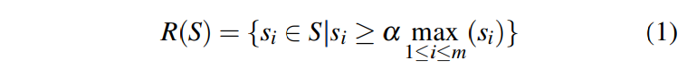

# Fast Shadow Detection from a Single Image Using a Patched Convolutional Neural Network

**3. Fast Shadow Detection from a Single Image Using a Patched Convolutional Neural Network**

在本节中，我们描述了我们提出的检测单个图像阴影的方法。

我们的方法使用两个步骤来学习训练图像的阴影。

首先，我们使用经过训练的SVM在颜色和纹理特征上获得先前的地图，然后我们使用原始图像和从第一步获得的阴影先验训练修补的CNN。这两个步骤将分别在第III-A和III-B节中详述。

为了检测给定图像中的阴影，我们首先使用SVM计算其阴影，并使用先验和图像作为训练的修补CNN的输入，仅考虑输入的每个超像素的中心像素作为代表性的，以减少计算时间。

然而，在这样做时，物体和阴影边界附近的超像素倾向于产生不可靠的“边缘效应”。

为了克服这个问题，我们再次使用补丁CNN来细化沿着超像素边界的边缘像素的预测标签。换句话说，算法使用经过训练的补丁CNN两次。第二个修补的CNN的输出提供最终检测到的阴影区域。我们的算法的边缘细化步骤将在第III-C节中讨论。

A.计算影子先验

阴影先验计算涉及图1的第一行中所示的步骤。我们首先使用均值移位算法\[23\]对图像进行分割以获得超像素。其次，在纹理和颜色特征上使用训练有素的分类器，我们估计每个区域的阴影概率。分割使我们能够估计每个区域而不是每个像素的阴影概率，因此，计算时间显着减少。通常，阴影区域比非阴影区域更暗且纹理更少\[18\]。因此，区域的颜色和纹理可以帮助预测它是否在阴影中。我们利用这种观察并用L \* a \* b空间中的直方图表示颜色，每个通道有21个箱，如\[16\]中成功应用的那样。我们用\[24\]提供的texton直方图表示纹理。我们训练我们的SVM分类器的颜色和纹理特征与χ2内核和松弛参数C = 1 \[25\]。我们定义每个超像素之前的阴影，作为该训练分类器的对数似然输出。在随后的步骤中，我们使用此阴影作为我们的补丁CNN的关键输入。

B.使用Shadow Prior训练Patched-CNN

在我们的阴影检测管道的下一步中，我们使用补丁智能CNN来预测阴影。 \[26\]中的当前研究表明，在阴影识别的情况下，使用具有特定大小的图像的补丁具有两个好处。首先，这些补丁包括足够的局部图像模式以及比基于像素的方法更大范围的邻域像素中的全局信息。其次，使用补丁我们能够从有限数量的标记图像中提供具有不同模式的更多训练样本。如所讨论的，在阴影检测的情况下的一个挑战性问题是训练样本的数量，其可以显着影响深度神经网络的准确性。不幸的是，由于阴影注释的高成本，可用的阴影基准数据集很小。这种贴片结构使我们能够提供大量的阴影和非阴影区域用于训练，可以提高网络的整体准确性。我们利用\[26\]中使用的网络架构。深层网络有六个卷积层，两个池层和一个完全连接层。该网络的输入是从组合RGB图像和阴影先前图像P中选择的32×32 RGBP补丁。输出是补丁的阴影概率图。我们选择相同数量的补丁用于三个类别的训练，如下所示。

* 阴影补丁：由于我们要学习阴影区域，我们首先从阴影区域中选择补丁。
* 非阴影补丁：我们从非阴影图像位置随机选择补丁，以包含各种纹理和颜色的补丁。 此外，这些选定的补丁可防止过度拟合。
* 阴影边缘补丁：我们还在阴影区域和非阴影区域之间的边缘上选择补丁，以了解阴影边界。 由于地面实况是二进制的，因此可以准确地提取所有阴影边缘的位置。

C.超像素标签的边缘细化

为了检测给定图像中的阴影，仅使用以超像素中心为中心的色块，并且将每个预测色块的平均值分配给超像素的所有像素。 这些由修补的CNN做出的预测是局部的，并且在阴影边界附近的预测结果很差。 为了提高检测算法的准确性，需要在区域之间进行更高级别的交互。 因此，在最后一步中，我们再次通过修补的CNN处理区域之间的边缘像素，如图1的最后一行所示。我们只处理区段之间边缘上的像素，标记为R（S） 并定义为：

R（S）包含具有比基于区域的预测P 0中的最大阴影概率的阈值更高概率的那些段。 α是恒定阈值（在我们的实现中等于0.2）并且m是图像中的超像素或区域的数量或基于区域的预测P 0。绝对非阴影区域总是在阴影先前映射中提供非常低的阴影概率，并且（1）仅过滤掉那些区域。该阈值处理步骤将减少要精炼的像素数量和该步骤的总时间。对于包含在R（S）中的段之间的每个边界像素（x，y），从其阴影先前和对应的原始图像围绕像素（x，y）的尺寸为32×32的窗口补片被给予补丁 - CNN预测该补丁的影子概率。然后我们将边缘像素（x，y）及其8个相邻像素的概率值设置为这9个像素的平均概率值。该步骤可以整合在先前步骤中获得的分割概率图，并且最终阴影概率图变得平滑。

参考意义不大

