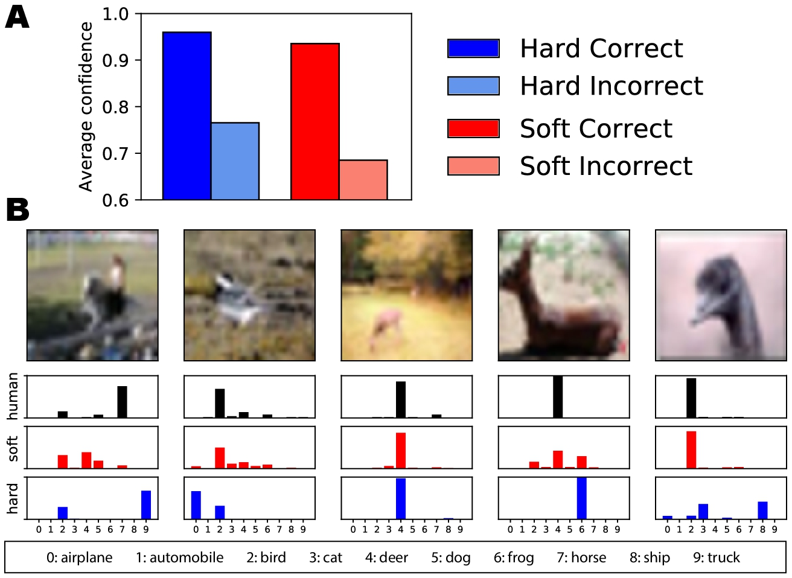

# Human uncertainty makes classification more robust

**Human uncertainty makes classification more robust**

## **摘要**

深度神经网络的分类性能已开始在接近完美水平上渐近渐近。但是，它们**没有在训练集外进行概括的能力以及对对抗攻击的鲁棒性**。在本文中，我们通过训练**可反映人类感知不确定性的完整标签分布来解决此问题**。我们首先介绍一个称为CIFAR10H的新基准数据集，其中包含CIFAR10测试集每个图像的完整人类标签分布。然后，我们表明，尽管当代的分类器本身无法表现出类似人的不确定性，但对我们的数据集进行**显式训练可以缩小这一差距**，对训练分布测试数据集之外的测试集合也有比较好的泛化能力，并在对抗性攻击下也具有鲁棒性。

## **1.简介**

在自然图像分类基准上，最先进的卷积神经网络（CNN）模型被认为等于或什至超过了人类的表现，以“ top-1准确性”来衡量-最可能的标记之间的对应关系通过模型和“地面实况”标签来获得一组测试图像。随着准确性的提高逐渐接近完美水平\[11\]，人们越来越关注训练集之外的表现，尤其是对相关刺激的概括能力\[39\]和对抗性例子的鲁棒性\[29\]。相比之下，在这些任务上，CNN的表现往往很差，而人类的表现却继续不错。

为了解决这个问题，并为训练分类器提供更好的标准，我们提出了一个替代目标：不仅试图捕获最可能的标签，而且试图捕获标签上的全部分布。**分类中的错误与正确答案一样具有参考价值。**例如，将狗和猫混为一类的网络，可能会比将卡车与猫混为一类的网络更好地进行归纳（参见\[1\]）。确实，请考虑图1所示的示例，其中CNN可能是置信度过低，置信度过高或系统上不正确，但仍获得了完美的准确性评分。**捕获这种相似性结构是有效泛化的关键部分**\[19\]，并且是在构建用于现实应用的分类模型时（例如，无人驾驶汽车中的避障对象）的重要考虑因素。

预测标签的更完整分布需要首先测量这些分布。鉴于我们无法直接从世界上提取 ground-truth 感官相似性，因此人类分类行为自然是进行这种比较的候选者。确实，人们通常在物体的种类上缺乏共识，**而人为错误常常传达有关视觉世界结构的重要信息**\[31\]。除了补充训练范式之外，**从人类收集这些完整的标签分布以更好地模拟人类偏见**并**预测其错误本身**本身很有趣-例如，这次是帮助无人驾驶汽车推断附近人类驾驶员的行为。最后，尽管在缩放数据集中的图像数量\[18\]和调查标签噪声\[40，12，48\]方面有大量工作，但从增加（信息性）标签分布的丰富度来识别收益方面所做的工作很少用于图像分类任务。

为此，我们做出了以下贡献：

* 我们提出了一个新颖的软标签数据集，我们称之为CIFAR10H，其中包括超过50,000个众包的人类分类判断，包括整个10,000张图像CIFAR10测试集的完整标签分布。
* 我们证明，当使用这些软标签训练最新的CNN分类器时，与硬标签控件相比，它们可以更好地归纳为样本外数据集。
* 我们提出了一种适用于人类标签的性能基准评估模型，并表明使用替代标签分布训练的模型也不能近似人类不确定性。
* 我们表明，当训练CNN在此基准上表现良好时，它们对对抗攻击的抵抗力会明显增强。

综上所述，我们的结果支持对模型泛化行为进行更细粒度的评估，并证明了一种将人类感知相似性整合到训练分类器范式中的方法的潜在实用性。

_图1：人类和我们最好的传统训练CNN（Shake-Shake \[11\]）达成一致的CIFAR10图像，但他们在系统上与其他选择有所不同。_

## **2.相关工作**

### **分层分类**

使用类混淆或层次结构来提高分类准确性或鲁棒性的工作可以追溯到早期的工作，例如，Griffin和Perona \[14\]，Marszalek和Schmid \[34\]或Zweig和Weinshall \[53\]。使用类别标签层次结构可以实现例如共享表示\[47、9、22\]，有效组合模型\[23\]或通过层次结构预测\[32、8\]来提高分类的准确性。有时会提出基准，使用分层指标进行评估（例如，ILSVRC 2010和2011的分层错误率\[41\]）。总体而言，尽管占主导地位的范例集中在评估top-K准确性，而不是分析系统的错误，并且层次结构主要用于培训。我们认为是时候重新考虑这一点了。首先，现代的大规模开放世界复杂数据集不再保证不重叠的对象类\[26\]，这使得层次类混淆特别有意义。其次，现有方法在top-K精度上已变得非常出色，因此，有必要将其针对对抗性示例\[44、13、2\]或分布移位\[45、39\]的稳健性日益关注。在这项工作中，我们向我们展示了对图像分类中人类不确定性的概括的首次大规模评估。

### 知识蒸馏。

可以手动构建\[6，3\]，从语言知识库\[10，9\]导出或自动学习\[14，19\]来帮助识别的标签层次结构。我们的工作最接近前者（手动构建），尽管我们没有明确地构造类层次结构，而是依靠类之间的人为混淆来推断给定图像的类之间的关系。尽管源于人类的困惑，但我们的工作与\[19\]的知识提炼方法有些相似。在知识蒸馏中，这些标签由预先训练的分类模型中平滑的softmax概率提供。当将软标签与基本事实结合在一起时，就可以实现模型传递和压缩的一种形式，因为softmax概率带有关键信息。此过程的原理与我们自己的相似：网络（和人类）通过将有关相似性结构的重要信息提取到我们根据图像及其类别推断的分布中，获得了极大的鲁棒性。但是，使用网络为他们提供知识（即知识提炼的标准应用）本身就存在问题，而无法与黄金标准进行比较：无法保证模型学到的相似性结构是正确的。

### 软标签。

我们工作的核心贡献之一是使用由于人为混乱而提供的软标签代替一键式标签编码。已经提出了几种方法来替代一站式编码，例如，在大规模的1000+方式分类中使用启发式方法平滑top-1标签\[43\]，或将测试时的人为不确定性纳入协作式计算机视觉系统中\[4\]。 \]。 mixup \[51\]是另一种新近开发的方法，用于基于示例对及其硬标签对的凸组合自动生成软标签，并且已被证明可以提高泛化性和对抗性，同时减少记忆。但是，由于线性约束在所有类别对上都是恒定的，并且标签是一个热点，因此很难了解此类标签的柔和度如何完全衡量感知相似度。

### 人体研究

最后，有许多研究还利用人类专家在诸如医学诊断系统之类的相关分类领域的训练标签上提供分布信息\[35，36\]。尽管这些研究提出的理论案例支持我们自己的观点，但它们并未提供用于评估其他分类模型的大规模测试平台。值得注意的是，人为不确定性标签通常无需明确收集，但会在数据收集过程中自动变为可用。众包工作的大部分集中在调和人类标签和减轻他们之间的分歧上（参见Kovashka等人\[25\]进行的调查）。我们的方法建议利用这些人为分歧来提高模型的准确性和鲁棒性，并补充旨在利用人为标示中的“错误”的现有工作\[27\]。

## **3.从标签到标签分布**

图像分类任务的标准做法是使用常见基准数据集（例如ILSVRC12 \[41\]和CIFAR10 \[28\]）中提供的“地面真相”标签进行训练，其中每个图像的“真实”类别是通过人类共识来确定的（模式选择）或数据库创建者。尽管在许多情况下都是有用的简化，但我们建议这种近似将偏差引入具有重要分布意义的学习框架。看到这一点，首先考虑以下训练期间的标准损失最小化目标：

其中，对于观察到的数据样本 $$(xi , yi)^n_i=1$$ ，具有参数θ的模型的损耗L最小。我们以这种方式训练模型的目标是很好地概括未见数据：在给定观察到的图像 $$(x_j)^ m_j=1$$ 将来从相同基础数据分布中提取的情况下，将未观察到的标签上的预期损失降至最低：

 当我们考虑该产品中的第二项时，我们可以看到，在数据集构建过程中使用模态标签只会是一个最佳估计，前提是对于任何刺激x，除了c分配的那个类别之外，每个c类别的基础条件数据分布为零人类的共识。相比之下，当我们考虑图1所示的网络和人的混乱时，我们可以看到确实存在这种假设违反了人为概率分配的情况。

 那么，我们如何才能更自然地近似 $$p(y|x)$$呢？对于某些问题，很容易从一组真实的数据中进行采样，但是对于图像分类，我们必须依靠人类作为黄金标准来提供对 $$p(y|x)$$的良好估计。如果我们期望人类图像标签分布 $$p_{hum}(y|x)$$ 可以更好地反映给定图像类别上的自然分布，则可以将其用作 $$p(y|x)$$ 的改进估计量。

 在 $$f_θ(x)$$ 是分布 $$p_θ(y|x)$$ 和 $$L(f, x, y) $$ 是负对数似然的情况下，预期的损失会减少到人类分布与分类器预测的分布之间的交叉熵：

## 4.数据集构建

虽然像ImageNet \[41\]，Places \[52\]或COCO \[33\]这样的大规模流行数据集似乎是最好的起点，但CIFAR10尤其具有一些独特且吸引人的特性。首先，对于社区来说，数据集仍然具有足够的兴趣，正在其上开发最先进的图像分类器\[11，21\]。其次，数据集足够小，可以让我们为整个图像测试集收集大量的人类数据。第三，图像的低分辨率有助于产生人类反应的变化。具有不重叠对象类别的高分辨率图像的人为错误率非常低，很难从相对较少的响应中获得有意义的信号。最后，CIFAR10包含许多接近类别边界的示例，与其他经过精心挑选的数据集相比，每个数据集都被选为类别的一个很好的示例。我们的最终CIFAR10H行为数据集由10,000个CIFAR10图像测试子集中的511,400个人类分类决策组成（每个图像约50个判断）。

### 4.1 影像刺激

 我们对CIFAR10的测试子集中的所有彩色图像进行了人工判断。其中包含以下10个类别中的每个类别的1,000张图像：飞机，汽车，鸟，猫，鹿，狗，青蛙，马，船和卡车。这使我们能够使用相同的测试图像评估在CIFAR10训练集上进行预训练的模型，但是根据标签上的不同分布，将在下一部分中进行详细介绍。

### 4.2 人的判断

 通过Amazon Mechanical Turk \[5\]，我们在刺激计划中收集了511,400种人类分类，据我们所知，这是迄今为止单项研究中最大的分类。在任务中，要求参与者通过单击尽可能快速且准确的（但没有时间限制）周围的10个标签之一来对每个图像进行分类。候选人之间的标签位置不符。在初始训练阶段之后，每个参与者（总计2,571个）对200张图像进行了分类，每个类别中有20张图像。每20项试验，都会出现一张明显的图像作为注意力检查，并且得分低于75％的参与者将从最终分析中删除（共14项）。我们平均每张图片收集了51条判断（范围： $$47-63$$ ）。平均完成时间为15分钟，并且向工人支付了$1.50的报酬。图1显示了针对图像选择的分类判断分布示例。

## 5.分布转移下的一般化

### 模型

我们训练了八种CNN架构（VGG \[42\]，ResNet \[16\]，Wide ResNet \[50\]，ResNet preact \[17\]，ResNext \[49\]，DenseNet \[20\]，PyramidNet \[15\]和ShakeShake \[11\]）。最小化softmax输出和CIFAR10H中图像的完整人类标签分布之间的交叉熵损失。使用PyTorch \[38\]训练了模型，并改编了脚注中的资料库。1对于每种架构，我们使用10倍交叉验证（每次使用9,000张图像进行训练）训练10个模型，并在测试时对10个模型的平均结果运行。为了获得更稳定的结果，我们使用k折而不是单个验证集。为了可重复性，我们将所有模型的存储库中的默认超参数都用于\[39\]，以提高可重复性，但学习率除外。我们使用Adam \[24\]优化器对每个模型进行了最多150个时期的训练，并针对基本学习率0.2、0.1、0.01和0.001（我们发现在所有情况下均为0.1）进行了网格搜索。

### 测试数据集

第3节的关键预测是，当推广到训练样本分布越来越多的情况下，我们标签中的不确定性将越来越有用。通过检查以下数据集的泛化能力，我们通过经验测试了此预测：CIFAR10：这是标准的数据集内评估。由于我们的CIFAR10H软标签用于CIFAR10测试集，因此在这里，我们使用标准CIFAR10训练集的50,000张图像来评估模型。

CIFAR10.1v6，v4：这是\[39\]创建的两个2,000图像近样本数据集，用于评估对CIFAR10经常用于验证的“测试”数据的拟合。这些图像取自TinyImages \[46\]，并且与CIFAR10中的子类分布相匹配。 v6每班有200张图像，而v4是原始班级不平衡版本（重叠90％）。CINIC10：这是样本外通用测试。\[7\]收集的CINIC10数据集包含CIFAR10图像和来自等效类的重新缩放的ImageNet图像\[7\]。例如，来自飞机，飞机，飞机（客机）和飞机，飞机，飞机（轰炸机）的ImageNet类的图像已分配给飞机CIFAR10顶级类。在这里，我们仅使用从ImageNet拍摄的210,000张图像。

ImageNet-Far：最后，作为更强的分布转移示例，我们构建了ImageNet-Far。如上所述，我们使用了重新缩放的ImageNet图像，但是选择了可能不在CIFAR10同义类的直接继承下的类。例如，对于CIFAR10标签鹿，我们包括了ImageNet类别的ibex，瞪羚，对于CIFAR10标签马来说，我们包含了ImageNet类别的斑马（CINIC10中未包括）。

推广措施。我们根据准确性和交叉熵来评估每个测试集上的每个模型。精度仍然是样本外概括任务分类性能的重要中心指标。由于准确性忽略了分配给猜测的概率，因此，我们还使用交叉熵度量来评估模型行为：它在最高预测中的置信度如何，以及其在替代类别上的分布是否合理。请注意，当使用单热矢量计算交叉熵时，这种解释自然会出现，因为只有分配给地面真相选择的概率质量才有助于得分。当计算与单点热矢量不同的，分配质量的人类软标签时，交叉熵变得更加有用。在这种情况下，网络的第二种猜测可能会给损失造成很大的影响，而第二种猜测为图像提供了最容易混淆的类别。为了提供对此更容易解释的启发式度量，我们引入了一种称为次优准确性（SBA）的新准确性度量。尽管top-1的准确性可能在很大程度上是渐近线，但我们希望SBA的收益仍有一段路要走。

