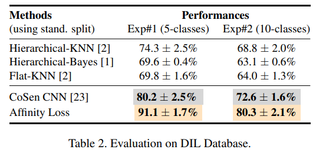
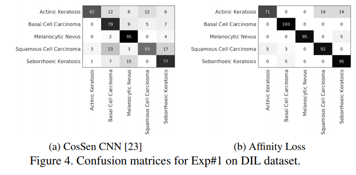
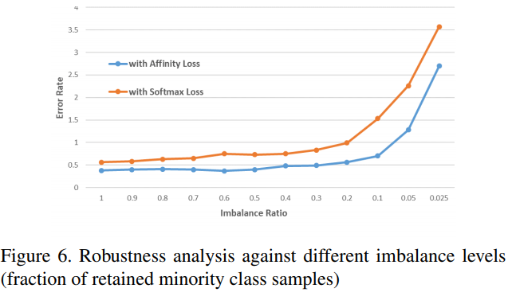
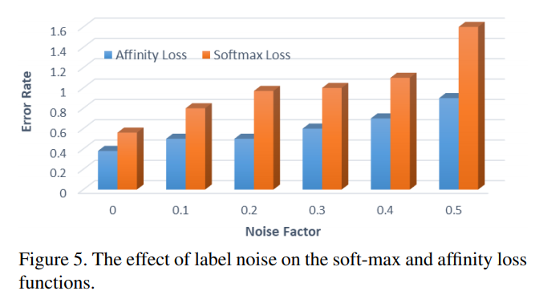

# Max-margin Class Imbalanced Learning with Gaussian Affinity

Max-margin Class Imbalanced Learning with Gaussian Affinity

**摘要**

真实世界的对象类以不平衡的比率出现。这对于那些偏向高频类的分类器来说是一个重大的挑战。我们假设提高分类器的泛化能力可以改善对不平衡数据集的学习。在这里，我们介绍了第一个混合损失函数，它在一个公式中联合执行分类和聚类。我们的方法基于欧几里德空间中的“有效性度量”，其导致以下好处：（1）直接强制对分类边界的最大边际约束，（2）确保均匀间隔和等距离的聚类中心的易处理方式，（3）灵活地学习多个类原型以支持特征空间中的多样性和可辨别性。我们的广泛实验证明了对多个不平衡数据集的可视化分类和验证任务的显着性能改进。建议的损耗可以轻松插入任何深层架构中作为可区分块，并展示针对不同级别的数据不平衡和损坏标签的鲁棒性。

**1.简介**

深度神经网络本质上是**数据饥渴的**，需要大量数据才能成功进行训练。**对于不平衡的数据集**，其中几个（可能很重要的）类具有较少的表达，**所学习的模型偏向于高度丰富的类**。这是因为稀缺类在训练期间具有较少的表示，这导致训练 p\(x,y\) 的联合分布模型与测试集p\(x', y'\)之间的不匹配。这导致稀有类别的召回率降低（漏检率），这在许多情况下是非常需要的。例如，与良性病变相比，恶性病变很少见，但不应错过分类。

**Soft-max**损失是传统识别任务中比较的流行选择。然而，通过大量实验，我们表明它不太适合处理训练集和测试机集间分布的不匹配问题。这部分是由于在分类空间中没有直接执行边际，以及缺乏控制类内变化和类间分离的原则方法。在这里，我们建议最大边缘学习可以通过学习所有类的平衡表示来改进泛化，这有助于减少对更频繁类别的分类偏差。值得注意的是，最近的一些努力集中于在 Soft-max 损失函数中引入最大边际约束\[10,33,32\]。由于 Soft-max 损失计算角域（矢量点积或余弦相似度）的相似性，角度边缘的直接执行是不适定的，并且现有的工作要么涉及近似，要么限制假设（例如，位于超球面上的点）。

_图1. Affeity Loss在单个目标中集成了分类和聚类。它在欧几里得空间中的灵活表达允许强制类之间的边界，控制学习集群，类原型的数量和类原型之间的距离。这种最大边际学习通过学习平衡的分类区域和可推广的类边界，极大地有助于克服类不平衡。_

在本文中，我们提出了一种新的损失公式，通过**同时减少类内变化和最大化类间距离**来**增强泛化**。

与以前的工作的显着区别在于欧几里德空间中的类代表原型的自动学习，其具有固有的灵活性以对所学习的原型实施某些几何约束。

这与Soft-max损失形成对比，Soft-max 中更丰富的类倾向于在投影的特征空间中占据更多的空间，与此同时罕见的类则有更少的表示。

目前提出的目标被称为“Affinity loss function”，因为它基于根据Bergman散度定义的高斯相似性度量。

所提出的损失公式学习**将输入图像映射到高度辨别的欧几里德空间**，其中类代表性原型间的距离为每个类提供直接相似性度量。

类原型是嵌入空间中的关键点，特征点聚集在其周围\[43\]。

Affinity loss function 能促使分类器在训练期间具有更简单，平衡且更通用的归纳偏差。因此，所提出的损失函数具有以下优点：

* 在欧几里得空间中联合聚类和分类特征向量的固有机制。
* 一种易于处理的方法来确保均匀间隔和等距的类原型（当嵌入维度d和原型编号n时相关为：n &lt; d+1 ）。
* 沿着均匀间隔的原型，我们的配方确保原型周围形成的簇均匀成形（就二阶矩而言）。
* 由此产生的分类器显示了针对不同级别的标签噪音和类别之间的不平衡的稳健性。

我们提出的损失函数是可区分的模块，其适用于不同的网络架构，并且结合了通常部署的正则化技术，包括丢失，权重衰减和动量。通过对大量数据集的广泛评估，我们证明它实现了高度平衡和可推广的分类，从而在了对先前技术的基础上有了显着提高。

**2.相关工作**

**类不平衡学习：**不平衡数据集表现出复杂的特征，从这些数据中学习需要设计新的技术和范例。现有的类不平衡方法可以分为两大类：

**1）数据级**，**2）算法级方法**

**数据级方案修改数据的分布**，例如，通过对少数类\[41,7,14,15,21\]进行过采样或对大多数类进行欠采样\[25,3\]。这些方法通常容易出现**冗余和过拟合（过采样）**和 关键信息丢失（对于欠采样）。

相比之下，**算法级别方法，**例如通过成本敏感学习来改进分类器本身。这些方法结合了关于类的先验知识，基于它们在训练数据中的重要性或表示\[26,38,23\]。这些方法已经应用于不同的分类器，包括SVM \[48\]，决策树\[61\]和增强\[49\]。一些作品进一步探索成本敏感的分类集合，以解决不平衡\[19,24\]。与这些对成本敏感的方法相关的一个主要挑战是，特定类别的成本仅在开始时定义，并且它们缺乏在培训过程中动态更新成本的机制。

**深度不平衡学习：**最近尝试从不平衡数据中学习深层模型\[20,23,5,52,36\]。

例如，\[20\]中的方法首先学习使用神经网络对训练数据进行抽样，然后使用基于合成少数过采样技术（SMOTE）的技术来重新平衡数据。深度模型经过训练，可直接优化\[52,36\]中的不平衡分类精度。

王等人 \[53\]提出了一种元学习方法，逐步将模型参数从多数转移到较不频繁的类。

一些工作\[23,5\]训练**代价敏感的深度网络**，或者**优化类代价和网络权重**。

在训练深度模型的同时持续的确定类代价仍然是一个开放且具有挑战性的研究问题，并且在从大规模数据集学习中使得优化变得难以进行\[18\]。

**联合损失公式：**

用于深度网络分类的流行损失函数包括**铰链损失，softmax损失，欧几里德损失和对比损失**\[22\]。

三重损失可以同时执行识别和聚类，但是由于大规模数据集上的**大量三重组合，其训练成本过高**\[40\]。

由于这些损失函数在**特征空间中实现可辨性的能力有限**，因此最近的文献探讨了多种损失函数的组合。

为此，\[44\]表明，软最大和对比损失的结合同时强化了类内紧凑性和类间可分性。在类似的路线上，\[54\]提出了“中心损失”，它使用单独的目标进行分类和聚类。

**最大边距学习：**传统上使用边距最大化的学习目标用于机器学习。

**支持向量机中的铰链损失**是开创性的最大边际学习框架之一\[16\]。最近的一些工作旨在将**最大边距学习与交叉熵损失函数**相结合。

其中，large-margin softmax \[33\]直接对点积相似性强制实现类间可分性，而SphereFace \[32\]和ArcFace\[10\]分别在超球面流形上强制乘法和加性角度边界。对于特征空间的超球面假设使得所产生的损失不太适用于除人脸识别之外的应用。

此外，在角度域中强制执行基于边缘的分离是一个不适定的问题，要么需要近似或假设（例如，单位球）\[12\]。

本文提出了一种新的灵活损失函数，它同时执行聚类和分类，并能够直接执行最大边际约束。我们接下来描述建议的损失公式。

**3. Max-margin框架**

我们提出了一种**混合多任务公式**，用于**对不平衡数据集进行学习**。

所提出的公式将分类和聚类结合在一个单一的目标中，**最小化类内变化，同时实现最大的类间分离**。

我们首先解释为什么传统的Soft-max Loss（SL）不适合大边缘学习，然后介绍我们新颖的目标函数。

**3.1 Soft-max损失**

给定输入 - 输出对 {xi , yi}，深度神经网络使用由θ参数化的函数F（即 f = F\(x; θ\) ）将**输入变换为特征空间表示 f\_i** 。

然后，软最大损失可以计算标签空间中预测和标签之间的差异，如下所示：

i ∈ \[1, N\] ，N是训练样例

j ∈ \[1, C\] ，C是类的数量

值得注意的是，我们在 Soft-max 损失的定义中**包含了最后一个完全连接的层**，这将有助于进一步分析。

另外，为了简洁起见，我们没有提到方程式1 中的**单位偏差**。

虽然 **Soft-max 损失**是多类分类中**最受欢迎的选择之一**，但在下面的讨论中，我们认为由于一些限制，**它不适合于类不平衡学习**。

**SL的局限性：**方程中的损失函数 1计算**向量内积 &lt; w,f &gt;**，其度量特征表达对**每个类矢量 w\_j 的投影**。目标是**将 f\_i 与正确的类向量 w\_yi 完美对齐**，以**使数据可能性最大化**。

由于Soft-max损失**依赖于矢量点积**，因此它具有以下局限性：

* **没有固有机制来确保最大边际限制**。计算softmax损失的类间间距是难以十分棘手的\[12\]。然而**大的类间间距能够促进不均衡分布的更好泛化和对输入变化的鲁棒性**\[9\]。
* **学习的投影向量不一定在分类空间中等距**。也就是说，理想地，最近投影矢量之间的角度应该相等（例如，2D中的2π/k，其中k是类的数量）。然而，在实践中，**与少数类相比，多数类的投影向量占据更多的角度空间**。这在图2中已经在不平衡的MNIST数据集上可视化，并且导致对测试样本的不良泛化。
* **不同类别的学习投影向量的长度 \|\| wj \|\|\_2不一定相同**。文献中已经表明，与多数类\[33\]相比，少数类投影向量更弱（即幅度更小）。已经证明，**成本敏感学习能够有效地增加少数类投影向量的大小**，**对于不平衡学习是有效的**\[23\]。

**SL对于不平衡学习的不适合性：**我们将上述限制归因于没有直接强制对分类边界进行最大边距约束。考虑点乘积w^T f 中软最大损失（方程1）的定义，我们可以简化表达式如下：

类对 {j, k} 的决策边界由

的情况给出，即，在这对类之间共享类边界。此外，L^i\_sm 的最小化需要

来正确分配给x。这是一个“相对约束”，因此 Soft-max 损失L\_sm不一定能够：（a）减少类内变化，（b）强制每个类对之间的间距。

为解决这些问题，我们接下来提出新的损失函数。

**3.2 混合目标的最大边学习**

**欧式空间相似性度量：**相对于使用矢量点积来计算类原型的相似性，我们建议使用**高斯相似性度量**中的**Bergman散度（平方 l^2 距离）**来测量欧氏空间中的输入特征的**类相似性**：

其中，σ表示加权参数。这为我们提供了：

（a）直接执行边距最大化约束的灵活性，

（b）针对多个类的**等间隔分类边界**，

（c）控制学习集群的**方差**，从而提高类内的**紧凑性**，

（d）在欧几里得域中使用**标准距离测量**来自由地度量相似性，

（e）最重要的是在**单个目标函数**中**同时进行分类和聚类**。

_图2.倒数第二层激活方面的2D特征空间投影。该模型使用不同的损失训练不平衡的MNIST数据（通过仅保留10％的数字0-4的样本）：_

（a）软 - 最大损失在角空间中学习口腔花瓣，注意少数类特征向量较弱（长度较短）并占据较小的角度空间。

（b）中心损失通过执行聚类减少了类内变化。然而，少数类向量往往在中心附近拥挤并且彼此混淆

（c）所提出的相关性损失为多数和少数类别学习**均匀形状的等间隔簇**。

**命题1.** _**相似度函数d\(a, b\)是任何实值输入的有效相似度量。**_

_证明：_如果满足以下条件，则实值相似度函数d\(a, b\)将定义有效的相似性度量\[30\]：

* 非负性: d\(a, b\) ≥ 0
* 对称性: d\(a, b\) = d\(b, a\)
* 等价性: d\(a, a\) = d\(b, b\) = d\(a, b\) iff a = b
* 自相似性: d\(a, a\) ≥ d\(a, b\)
* 三角相似: d\(a, b\) + d\(b, c\) ≤ d\(a, c\) + d\(b, b\)

因为，所有上述条件对于 d\( . \) 都是正确的，因此，它是一个有效的相似性度量。

**点积与高斯相似性之间的关系：**

所提出的高斯相似性度量与点积相关如下：

直观地，上述关系意味着 Soft-max 损失对 特征向量和类原型 的**尺度/幅度的依赖性**。它导致两个结论：

（1）可以看出 由于\|\|f\_i\|\|2 + \|\|w\_j\|\|2 ≥ 2&lt;w\_j,f&gt;，d\(f\_i, w\_j\) 处于\[0,1\]之间，而&lt;w\_j ,f\_i&gt;可以有很大的幅度。

（2）当矢量的大小被归一化为相等时，高斯测量可以被认为是逆弦距离。在这种情况下的点积与高斯相似性成正比，并且如果在我们提出的相似性度量中不包括附加约束，则两个相似性度量将表现得相似。然而，我们制定的主要内容是明确引入边际约束，我们接下来会介绍。

**在类之间强制执行边距：**请注意，**Soft-max** 损失的某些变体会引入基于角度的边距约束\[32,10\]，但是，角域中的边距在计算上代价较大，并且由于难以处理而仅实现为近似。我们的公式允许在损失函数中有更直接的边界惩罚。基于方程3，建议的最大边际损失函数由下式给出：

其中 d\(f\_i , w\_j \) 是**样本与其真实类的相似度**，d\(f\_i , w\_yi \) 是**与其他类的相似度**，**λ是强制边距**。

**统一分类区域：Soft-max** 损失不能确保所有类别的统一分类区域。

因此，与更频繁的类相比，欠采样的少数类在特征空间中获得缩小的表示。

为了确保**等距离权重向量**，我们建议对**学习的类权重应用正则化**。

该正则化器被称为“**多样性正则化器**”，因为它**强制所有类中心（w）在特征空间中均匀分布**。

多样性正则化器的形式定义如下：

其中μ是**所有类原型之间的平均距离**。

**多中心学习：**

对于具有挑战性的分类问题，可以对特征空间进行划分，使得**属于同一类的所有样本不共同位于单个区域中**。

因此，在这种情况下，使用单个原型（类中心）聚类所有相同的类样本将不是最佳的。

为了解决这一局限，我们引入了一种**基于最大边际框架的新型多中心学习范式**。

建议的框架不是为每个类学习单个投影向量wj，而是**允许每类学习多个投影向量{wt}j**。

具体来说，我们可以**学习每个类的m个投影向量**，其中**特征向量f\_i与类j**的相似性由下式给出：

然后将最大边际损失定义为类似于Eq 6以上。因此整体损失函数变为：

多中心案例的多样性正则化是针对所有 m ∗ C 原型之间的相似性而强制执行的。

**4.实验**

为了证明所提出的能量损失的有效性，我们对表现出**自然不平衡的数据集进行了实验**。这些包括用于皮肤病变分类的Dermofit图像库（DIL）和用于面部验证的大规模图像数据集。我们通过系统地产生不平衡并引入不同水平的标签噪声来进一步广泛地评估所提出方法的各种组件。通过这些实证评估，我们提供了所提出的方法对不同数据不平衡水平和噪声训练标签的鲁棒性的证据。接下来将介绍有关评估数据集的简要说明。

**4.1 数据集**

**4.2 实验设置**

对于DIL数据集的实验，ResNet-18骨干与所提出的 affinity 损失结合使用。

为了训练模型以学习面部验证任务的特征，我们部署了具有ResNet-50骨干和能力损失的挤压和激励（SE）网络\[17\]。

使用多任务级联卷积神经网络（CNN）\[59\]裁剪人脸图像并将其重新调整为 112×112 。使用随机水翻转作为数据增强的方法来训练模型。

然后，在全局池层之后提取的特征用于对不同数据集的面部验证评估。MNIST上的实验是在一个简单的网络上进行的，其中四个隐藏层具有三个卷积层（5×5大小的32,64和128个滤波器），一个完全连接的层（128个神经元）和一个输出层。

该模型采用随机梯度下降（SGD）优化器进行训练，具有动量和学习速率衰减。对于第二节的烧蚀研究。 4.6，我们只改变输出的soft-max层与建议的Af功率损耗层，并保持架构的其余部分固定。

**4.3 结果与分析**

表 2 给出了我们在DIL数据集上的实验结果。

在实验＃1中，我们报告了五种类别（光化性角化病，基底细胞癌，黑素细胞痣，鳞状细胞癌和脂溢性角化病）的3倍交叉验证的平均表现。与现有技术水平\[23\]相比，我们在Exp＃1上实现了10.9％的绝对增益。

对于DIL数据集上的Exp＃2，将考虑所有10个类。表2中3倍交叉验证的评估显示，Exp＃2的显着性能提高了7.7％。

图4中的用于分类精度比较的混淆矩阵分析表明，对于**表达较的少数类的性能提升**是更为明显。

我们将此归因于所提出的方法的能力，即通过执行特征空间聚类来同时**优化类紧凑性**，并通过实施最大边界约束来**增强类间可分离性**。

我们的方法在表3中的LFW和YTF数据集上实现了竞争性能。LFW和YTF的表现已经饱和，许多最近的方法**超过了人类水平的结果**。

这些数据集上表现最好的方法已经在更大的模型上进行了训练，其中数据和模型参数显着增加。

对其他面部识别基准的进一步评估分别在AgeDB30，CFP-FF和CFP-FP数据集上获得95.9％，99.5％和96.0％的验证准确度。

这些结果证明了**该方法对大规模不平衡学习的有效性**。值得注意的是，我们提出的Affinity损失不需要额外的计算和内存，并且可以轻松扩展到更大的数据集。这与一些现有的损失公式（例如三重态损失\[40\]和对比度损失\[13\]）形成对比，这些公式**确实增强了特征空间可辨性**，但由于训练对，三元组或五胞胎的大量可能组合而遭受大数据的可扩展性。

**4.4 推广**

为了测试所提出的方法对不同不平衡程度的推广，我们通过改变MNIST数据上少数类样本的表示来逐渐减少训练集。具体而言，我们通过随机丢弃最初五位数（0-4）的样本，逐渐将大多数变为少数类别比率（最高为1：0.025）。因此，在这些设置下，我们有明显更少表达的方法为一半的类发送。关于保留的少数类样本的分数的误差率的实验结果显示在图6中。我们还重复这些实验以获得标准的Soft-max损失。

图6中的比较表明了所有设置中所提出的损失函数的始终如一的优越性能。对多数类和少数类之间较大的不平衡水平，对绩效的影响更明显。

通过**强制执行边际最大化约束**，所提出的Affinity损失**增强了类级间的可分离性**。软最大损失没有固有的边际学习特征。

此外，与软最大损失相比，其中类内变化可以根据其代表性样本而在不同类别之间变化，**affinity 损失则可以学习到大小统一的类**。

如图2中可视化，在Soft-max 损失类别差异内的特征空间，**与其多数对应物相比，少数类占据紧凑区域**。

相比之下，我们提出的**损失公式是灵活的**，并且允许学习类原型**等距并形成均匀形状的簇**。这**减少了对较不频繁情况的偏差**，并**增强了整体泛化能力**，从而产生了更具辨别力的学习特征空间和改进的性能。

**4.5 对抗噪音标签的稳健性**

对于许多实际应用，所获取的数据具有噪声标签，并且非常期望针对标签噪声的学习方法的推广\[42,50,19\]。

为了检查我们提出的方法对训练数据中**噪声标签的鲁棒性**，我们随机地查看了MNIST训练样本的类别。

未标记样品的分数从10％逐渐增加到50％，增量为10％。为了避免对噪声数据进行过度拟合，我们部署了early stop\[57\]，并在保持**交叉验证集的性能开始下降时进行完成培训**。

为了比较，我们使用标准的soft-max损失重复所有实验。图5中的实验结果表明，所提出的**Affinity loss在不同噪声水平的整个范围内表现更好**。

尽管Soft-max和Affinity loss的性能随着噪声系数的增加而降低，但所提出的Affinity loss表现出更强的鲁棒性，**特别是对于较大的噪声比，具有相对较小的性能下降**。

我们的损失中的多中心学习**为嘈杂的样本提供了灵活性**，使其与不同于非噪声和干净样本的类原型相关联。

**4.6 消融研究**

**集群中心的数量：**所提出的融资中心的一个独特方面是它的多中心学习，它为我们提供了为每个班级提供多个类原型的灵活性。

在这里，我们通过逐步将每个类别的代表性原型数量从1改为20来对不平衡的MNIST数据集（第一个五位数的10％表示）进行实验。

在图8中的误差率与原型m的实验结果表明，m &gt;= 5 实现了最佳性能。**每个类的原型较少（ m&lt;=5 ）会产生相对较差的性能**。

当原型增加到5以上时，所提出的方法一致地执行。这种**多中心学习支持输入样本的多样性**。

它在具有复杂数据分布的情况下特别有用，其中在同一类的样本中观察到大的差异。

这样的不同样本可能不一定聚集在单个区域周围，并且**可以通过所提出的多中心学习机制形成多个聚类**。

此外，我们的实验在Sec 4.5显示通过提供灵活的类原型，多中心学习证明了**针对噪声样本的有效且稳健的方案**。

Cluster Spread σ：方程式中的参数σ。 3确定群集扩散并有助于实现统一的类内变化。我们对图2中学习特征的2D可视化表明，每个类的聚类对于多数类和少数类都是一致的。这与传统的软最大损失形成对比，传统的软最大损失在少数类别中观察到收缩的特征空间区域。对于我们提出的损失公式，簇的大小与参数σ的值直接相关，具有更大的σ距离表示群集方差更大。我们对不平衡的MNIST数据集进行实验，以获得参数σ = {.1, .5, 1, 5, 1e1, 2e1, 5e1}的不同值。图7中的结果表明，对于σ在5和20之间的值，实现了最佳性能。非常高的σ值导致较大的簇扩展，导致类之间的重叠和混淆以及较低的分类性能。

**距离和相似度量：**我们在方程式中的原始自适应损失公式。 3首先计算特征f和类原型w之间的平方l2距离，然后使用高斯度量将其转换为相似性度量。在本实验中，我们评估距离和相似度量的不同组合。l1和l2度量用于计算距离，而高斯和反距离（由1/\(1+x\)定义）是两个相似性度量。我们对不平衡的MNIST数据进行这些实验（通过保留10％的样本用于前五位数）。表。 4显示了我们的评估结果。除了 l1 距离和高斯相似性之外，所提出的方案适用于所有组合，其中它无法收敛。对于高斯相似性以及平方 l2 距离，实现了最佳性能。

