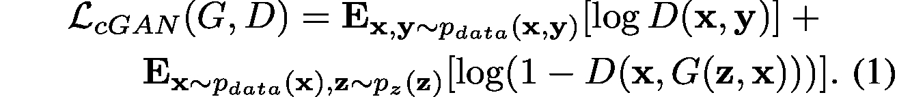
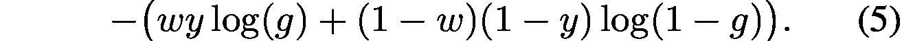
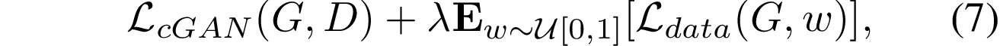
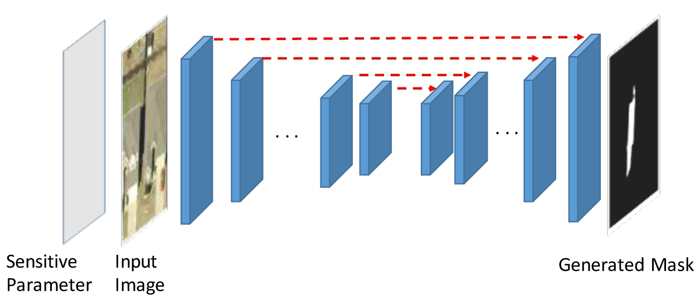

# Shadow Detection With Conditional Generative Adversarial Networks

**9、Shadow Detection With Conditional Generative Adversarial Networks**

在本文中，我们提出了一种基于条件生成对抗网络（cGAN）\[20\]的阴影检测方法，这是一种特殊类型的生成性对抗网络（GAN）\[3\]。cGAN有两个组件：鉴别网络和生成网络。可以训练生成网络以产生以输入图像为条件的输出图像。在我们的例子中，我们将训练cGAN的生成网络在给定输入场景图像的情况下产生阴影掩模。与局部区域分类不同，cGAN的生成网络具有整个图像的完整视野，并且可以推断全局结构和上下文。同时训练生成网络输出与场景图像充分协调的阴影掩模; 否则，鉴别器可以容易地区分生成的阴影掩模和真实的阴影掩模。

在本文中，我们提出了scGAN，一种具有可调灵敏度参数的新型cGAN架构。scGAN在多个方面与cGAN不同：网络架构，损失功能和训练过程。

 i）scGAN的生成网络有一个附加输入，即灵敏度参数，如图1所示.

ii）生成网络的训练损耗增加到包括一个损失项，鼓励生成网络输出和相应真实值之间的一致真相目标图像。该损失项基于加权交叉熵，其中权重对应于灵敏度参数。

iii）我们提出了一种有效的训练程序，以训练生成网络适当地响应不同的灵敏度参数值。

近年来，阴影检测取得了很大进展。汗等人。

\[9\]首先使用深度学习来自动学习阴影检测功能，从而显着改善了现有技术水平。首先，他们训练了两个卷积神经网络（CNN）：一个CNN训练用于标记阴影区域，另一个CNN训练用于标记阴影边界。然后，来自两个CNN的预测被组合成CRF的一元潜力，CRF将图像像素标记为阴影/非阴影。他们还使用Ising在CRF中添加了成对电位，这会对具有相似强度的相邻像素的不同标签分配进行惩罚。

Vicente等人。 \[27,29\]提出了一种用于阴影区域分类的多核模型。基于最小二乘SVM留一出估计，有效地优化了模型的参数和超参数。他们还将多核区域分类器嵌入到具有基于上下文的成对电势的CRF中。他们的成对势能引入了比Khan等人的简单Ising先验更多的语境线索。 \[9\]。然而，这些仅模拟图像的相邻区域之间的局部相互作用。

Vicente等人最近的工作。 \[30\]使用堆叠的CNN进行大规模阴影检测。堆叠架构重新定义FCN的图像级别预测\[17\]，预训练用于语义标记，基于补丁的CNN在阴影数据上进行调整。该架构在多个数据集上实现了最先进的结果。然而，这种方法不是端到端的，并且需要繁琐的两步训练：首先，训练FCN以生成图像级阴影先验。然后将图像级别先验与RGB本地补丁组合，用于稍后训练基于补丁的CNN，其为本地补丁产生阴影掩模。在这种方法中，一些更全局的上下文被认为是FCN进行图像级预测。然而，最终的阴影预测是由基于补丁的CNN做出的，它没有考虑比补丁宽度更远的像素。

**3.用于阴影检测的scGAN**

**3.1。条件生成对抗网络**

生成性对抗网络（GAN）\[3\]，最近被提出用于图像的生成模型。GAN由两个对抗网络组成：生成器G和鉴别器D.生成器G的目的是生成逼真的图像，该图像已经作为输入z给出，是从一些噪声分布中采样的潜在随机向量。鉴别器D学习分类给定图像是否由G（假样本）生成，或者它确实是来自训练集的真实图像。因此，这两个模型相互竞争。 G旨在生成难以识别为假的D图像，从而从训练集中学习数据分布。同时D旨在避免被G欺骗。

条件生成对抗网络（cGAN）\[20\]是GAN的扩展，允许向生成网络（G）和鉴别网络（D）引入附加的观察信息（调节变量）。例如，通过使用输入RGB场景图像x作为调节变量，可以将cGAN应用于阴影检测任务。生成网络G被训练为输出阴影掩模G\(z, x\)（z是GAN的随机变量），其可以实际上对应于y, 输入图像x中描绘的阴影。G学习对训练数据的分布 P data\(x,y\)进行建模，该训练数据由输入图像x和真实阴影掩模y组成。然后D呈现（x，y）或（x，G\(x,y\)），并且必须确定该对是否真正来自训练数据。 cGAN的目标函数是：

使用cGAN的先前作品\[6,18,25\]经常引入数据丢失项以鼓励生成的图像 G\(x\) 接近地面实况图像y，例如，

鼓励生成网络愚弄鉴别网络并产生接近真实性的输出。

训练cGAN等同于发生器和鉴别器播放最小 - 最大游戏：

条件GAN为阴影检测提供了一个优雅的框架。cGAN能够有效地实施更高阶的一致性，这些一致性不能用CRF成对术语或每像素数据损失建模。这要归功于对抗模型能够评估输入图像和输出掩模的联合配置\[18\]。与先前的阴影检测方法相比，这为我们的方法提供了优势。

阴影检测是具有高度不平衡类的二元分类问题：**通常，阴影像素明显少于自然图像中的非阴影像素。但是，期望两个类的良好性能。这通常通过相应地调整分类阈值和/或为每个类别设置不同的错误分类成本来解决。**不幸的是，这两种方法都不能轻易应用于标准cGAN配方。首先，由于对抗训练，G将学习在阴影掩模中输出二进制值，否则鉴别器D将很容易检测到伪造（groundtruth掩模是二进制的）。其次，尽管_Ldata_\(G\)可以采用每类加权损失的形式，但是适当地调整这些类权重将需要网格搜索，其中模型在所有可能的权重值上重新训练，可能是极大的计算成本。

**3.2。灵敏度参数**

与cGAN相比，scGAN具有额外的灵敏度参数w，其有两个目的，参见图2。首先，它是生成网络G的输入，它控制生成网络的灵敏度。生成网络G仍然以输入场景图像为条件，但是较大的w将生成具有更多阴影像素的预测阴影掩模，反之亦然。其次，参数w也是损失函数的参数，加权阴影和非阴影类的相对重要性。形式上，考虑一个特定的像素并假设地面实况值为y（ 如果这是阴影像素，则为y=1，对于非阴影像素，为y=0 ）。假设生成网络输出该像素（0&lt;=g&lt;=1）为阴影的概率值g。此像素的数据丢失定义为加权交叉熵损失：

如果y是阴影像素，则此损失为-wlog\(g\);如果y为非阴影像素，则此损失为\(w-1\)log\(1-g\)。因此，如果w &gt;&gt; 1 - w ，我们将惩罚错误分类的阴影像素，而不是错误分类的非阴影像素。

令 G \( x , w \)表示灵敏度等级w的输入图像x的预测阴影概率图。为了便于数学，假设G \( x , w \) 表示为列向量（矢量化图像），并且真实阴影掩模y也是列向量。 scGAN的数据丢失期限定义为：

最后，scGAN的目标定义为：

其中u \[0,1\] 表示0和1之间的均匀分布。可以对抗地训练发生器和鉴别器。鉴别器旨在最大化上述目标，同时发电机试图最小化目标。一旦经过训练，我们就可以获得一个生成器，它有效地是由灵敏度参数w参数化的阴影检测器。这样就可以有效地调整探测器对阴影像素的灵敏度，而无需重新训练模型。

_图2：用于阴影检测的scGAN。灵敏度参数w会影响发电机的损耗，并且无需培训多个模型来调整类平衡。_

**3.3。生成网络和鉴别网络架构**

**生成网络的体系结构。**

我们模型的生成器受到U-Net架构的启发\[26\]。最初设计用于图像分割的UNet有两个部分，一个是卷积网，后面是一个反卷积网。存在连接卷积网和卷积网的层的旁路收缩路径，这导致细分和更精确的定位。

我们的架构类似于\[6\]，具有以下层：conv64，转换RB128，转换RB256，转换RB512（5次），deconv DR512（3次），deconv R512，deconv R256，deconv R128，deconv R64，deconv 1 ，其中conv表示卷积层; conv RB表示Leaky ReLU（斜率0.2），卷积层和批量归一化的块; deconv R表示ReLU块，后面是反卷积层，批量标准化和串联; deconv DR是一个deconv R，在批量标准化之后立即有一个额外的丢失层; deconv表示ReLU和反卷积层，后跟tanh算子。每个卷积和反卷积层的过滤器尺寸为5X5，步幅为2。层面值之后的数字对应于相应卷积或反卷积层中的滤波器的数量。i-th deconv块中的串联层连接其前一个丢包层和\(8-i\)-th转换层/块的输出。生成器网络的输入是4维图像。前三个维度是输入图像的RGB通道，4-th维度是灵敏度参数w。生成网络的结构如图3所示。

_图3：Generator的架构，基于U-Net \[26\]的编码器 - 解码器，跳过连接类似于\[6\]。_

**鉴别网络的架构。**

鉴别网络的输入是一对图像，RGB场景图像和阴影图图像，其是地面实况图或由生成器生成的图。具体而言，RGB图像将与掩模堆叠，以形成具有4个通道的输入。鉴别器的输出是图像对是真实的概率值，即，阴影图实际上是与场景图像中的阴影对应的阴影掩模。鉴别网络是具有以下层的CNN：conv R64，conv BR128，conv BR256，conv BR512，FC其中conv R表示卷积层，接着是Leaky ReLU; conv BR是卷积层，批量归一化和Leaky ReLU的块; FC是完全连接的层，结合了S形激活功能。

**3.4。训练细节**

我们用随机梯度下降和Adam解算器\[10\]训练一个scGAN，类似于\[6\]。一次训练迭代包括在D上执行一个梯度步骤，然后在G上执行两个梯度步骤。这是为了确保鉴别器的损失不会达到零。在每次迭代中，我们选择一个图像并使用数据增强从图像创建一批多个训练实例。该批包含：

使用上述过程，我们从每个原始训练图像中获得平均13个训练实例。在每次训练迭代中，使用从u \[0, 1\] 采样的新值w训练每个实例。我们从头开始训练我们的scGAN。我们通过从具有标准偏差0.2的零均值正态分布中采样来初始化G和D的卷积和反卷积层的所有权重。我们将所有偏差设置为0。

_图4：加权聚合方案。图像的最终预测阴影图是在多个位置和比例下针对多个图像块计算的阴影图的加权平均值。平均而言，每个图像有280个重叠的补丁，以及a = 25，β = 5，γ = 1。_

**3.5。多（cid：173）比例阴影预测**

给定测试图像的阴影图如下获得。从图像中，我们获得多个尺度的重叠图像块。将每个图像块调整为256×256，并将其送入生成器以获得256×256的阴影图。阴影贴图缩放回相应贴片的大小，并聚合多个重叠阴影贴图以创建测试图像的阴影贴图。从多个尺度的测试图像获得的图像块是：

通过这种配置，每个测试图像平均有280个作物。最终预测的阴影贴图是来自所有调整大小的阴影贴图的像素预测的加权平均值。标尺s1，s2，s3的权重a，β，γ 分别为25,5和1。图4描绘了这种预测过程。

