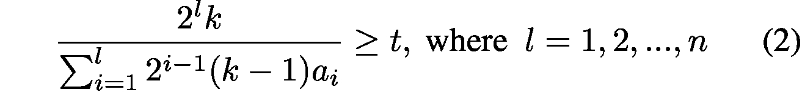

# A practical theory for designing very deep convolutional neural networks

**12、A practical theory for designing very deep convolutional neural networks**

增加深度大大提高了整个网络的学习/配置能力，同时只是线性增加了模型尺寸和计算成本。尽管深入已经成为一种常识，但仍然不清楚如何有效地设计一个非常深的卷积神经网络。大多数情况下，任意添加更多层并没有帮助，甚至会恶化性能。

在这项工作中，我们提出了一个有效设计非常深的卷积神经网络的实用理论。如图1所示，我们将卷积神经网络划分为两个级别，即**分类器层级**和**特征层级**，我们专注于在特征级别设计一个非常深的架构，同时在分类器级别使用固定的简单设计（这个部分将在最后描述）。

**分类器层级的设计。**

分类器级别的通用设计是两个完全连接的层，每个层都有dropout。然而，如果训练集不够大，我们发现这种设计很容易过度拟合。

我们凭经验发现，最好将输入特征映射下采样为小尺寸（6x6,7x7或8x8），然后应用两个5x5卷积层，最后将特征映射最大值汇总到矢量中并dropout此矢量。

由于内核尺寸对于特征图相关性特别大，因此卷积层更像是完全连接的层。理解这种设计的一个视角是进行密集滑动窗口测试（用于VGG的工作）并通过最大池化来聚合最终结果。

**第一个约束：学习能力**

卷积层的功能是从输入模式组成更复杂的模式。如图2（a）所示，给定模式A和B的响应及其空间关系，卷积层可以形成/检测更复杂的模式AB。然而，卷积层并不总是具有学习更复杂模式的能力。在图2（b）中，我们展示了卷积层无法学习更复杂模式的简单情况。在这种情况下，滤波器尺寸小于模式A和B的响应之间的距离，换句话说，它不能检测模式A和B以及它们的空间关系，因此无法学习更复杂的模式AB 。**为了重新获得学习能力，我们可以使用更大的卷积核，或者通过使用步幅2的下采样将响应距离减半**。在这项工作中，我们只通过下采样来重新获得学习能力。

学习失败的可能性随着卷积神经网络深入而没有下采样而增加，因为检测到的模式的大小及其有意义的空间关系逐层增长。一旦多数输入模式的空间关系超过卷积层的滤波器大小，该卷积层将失去其学习更复杂模式的能力。

为了定量测量卷积层的学习能力，我们如下定义卷积层的c值。

**c-value = Real Filter Size/Receptive Field Size**

其中k-by-k卷积层的实际滤波器大小为k，如果没有下采样，则在每次下采样后加倍，即一次下采样后2k，两次下降后4k抽样等接收场大小定义为神经元在原始图像上可以看到的最大大小。随着卷积神经网络的深入，它会按比例增长。图3显示了接收域如何在示例卷积神经网络中生长。

值得注意的是，我们使用接收字段大小而不是输入模式的空间关系的典型大小。因为后者是不可测量的，即使它在概念上更准确。在定义中，我们隐含地假设卷积层的接收场大小与输入模式的空间关系的典型大小成比例。

在上面的讨论中，我们准备提出设计非常深的卷积神经网络的第一个约束：

**每个卷积层的c值应大于最小值t。我们凭经验发现t=1/6是各种任务中所有卷积层的c值的下限。**

**第二个约束: 学习的必要性**

随着接收领域的增长，新的和更复杂的模式不断涌现。在此过程中，随着接收场的增长，我们需要额外的层来学习新出现的模式。然而，当接收场达到图像大小，即神经元已经看到整个图像区域时，它停止出现新的和更复杂的图案，用于添加新层的驱动力不再存在。

根据经验，我们发现在接收场饱和后通常会增加许多层次，但更糟糕的是，它增加了过度覆盖的风险并且在大多数情况下会损害性能。

基于上述分析和我们的实证研究，我们提出了设计非常深的卷积神经网络的第二个约束。

**最顶部卷积层的接收场尺寸应不大于图像尺寸。**

该约束意味着最顶部卷积层的接收场必须围绕整个图像区域。如果最顶层的接收场比图像区域小得多，我们可以再添加一层来改善我们的目标（即增加深度）而不违反约束。从另一个角度来看，如果接收场的图像尺寸小得多，则网络将失去查看和学习高级模式/特征的机会，这对于性能来说是次优的。

对于某些任务，在一定范围的接收场中没有有意义或有区别的模式/特征，因此不需要使用许多层来学习，即最大化整个网络的深度不再有效。我们将在本文的后半部分对此主题进行更多讨论。

**数学公式**

在本节中，我们将深层架构的设计制定为约束优化问题，然后在一定条件下提出并证明最优解。如前所述，我们假设所有层的滤波器大小相同，我们不考虑滤波器数量，因为它依赖于任务和数据集。

公式

在这里我们定义输入参数的符号。它们是图像尺寸z，滤波器尺寸k和最小c值t。

深度模型的体系结构可以通过阶段n的总数和{ai} 的各个阶段中的层数来确定。通过下采样（步幅2）划分各个阶段。例如，n=3和 a1, a2, a3 = 4,3,2 表示具有3级的模型，第一级，第二级和第三级中的层数分别为4,3,2。在两者之间采用步幅2进行下采样。

基本上深入的目标是最大化层的总数，即Σiai，给定前两节中提出的两个约束。

第一个约束要求所有层的c值不小于最小c值t。随着接收场的不断增长，并且一个阶段中的真实过滤器尺寸保持不变，一个阶段中最后一层的c值最小。因此，第一个约束相当于确保每个阶段中最后一层的c值不小于最小c值t，这可以转换成一组不等式，

其中分子是第l阶段的实际滤波器大小，分母是第l阶段最后一层的接收字段3，t是最小c值，我们为所有任务设置t=1/6。

第二约束要求卷积层最顶部的接收场不大于整个图像区域。它可以正式表示如下。

其中左项是最顶层卷积层的接收场，

是第i阶段层的接收场增量，

是第i阶段的总接收场增量。

我们的公式的目标函数可以通过最大化层的总数来形式地表示，受到等式（2）和（3）中的两个约束。通过略微改变这两个约束，我们实现了如下最终公式。

其中n和{ai}都是整数。我们通过等效变换简化了第一和第二约束的形式，以便于后面的讨论。

**在一定条件下的最佳解决方案**

在本节中，我们表明我们的配方的最佳解决方案可以在某些条件下找到。

假设图像大小为

，层数 {ai} 从整数放宽到正实数，我们可以证明我们目标函数的最优解是

