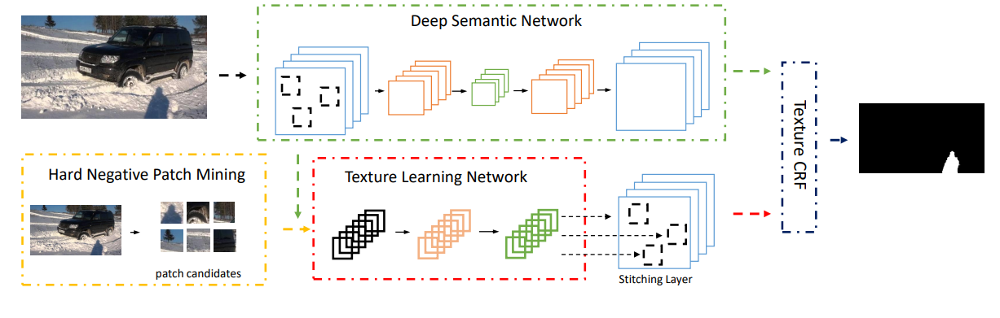
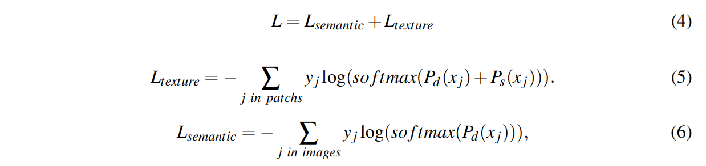

# Shadow Detection Using Robust Texture Learning

**13、 Shadow Detection Using Robust Texture Learning（BMVC 2018）**

在本文中，为此提出了一种新颖的 hard negative patch mining 模块。与物体检测中的hard negative方法不同，阴影检测实际上是不具有显式标签（正/负）的分割任务。它只有每个像素的标签，如阴影和非阴影。为了克服这个障碍，我们建议使用来自反向传播的梯度来估计每个补丁的难度级别。我们用于分割的hard negative patch mining 模块被证明可以通过实验和可视化生成合理的块。

最终的架构由纹理学习和语义学习网络组成。

纹理学习网络遵循我们的hard negative patch mining模块。语义学习网络是结构化的完全卷积网络。我们利用两种技术构建了一个集成的端到端可训练网络 - 补丁提取和后向拼接。消融实验已经显示了我们的纹理学习模块的强大功能及其对一般网络的改进。

综上所述，本文主要包含以下三个方面的贡献：

1、提出了一种新的硬阴性补丁挖掘模块，用于阴影检测任务中的鲁棒纹理学习;

2、提出了一种端到端的可训练网络，将纹理特征与语义特征相结合;

3、为了公平比较，进行消融实验，我们提出的模型在大多数基准测试中实现了最先进的性能。

**本文方法**

我们在图2中展示了我们的整体网络。我们的整体模型由一个深层语义学习网络和一个纹理学习网络组成。 深度语义网络是具有VGG骨干的完全卷积网络。 纹理学习网络从补丁挖掘模块中获取补丁并从深度语义网络中提取特征映射。 提出了一种硬阴性补丁挖掘模块，用于选择硬补丁候选者来训练每个时期。 纹理和语义网络的输出最终将集成到自定义CRF中以生成整体预测。

图2：整体阴影检测网络。 我们的整体模型由一个深度语义学习网络和一个纹理学习网络组成。 深度语义网络是具有VGG骨干的完全卷积网络。 纹理学习网络从补丁挖掘模块中获取补丁并从深度语义网络中提取特征映射。 提出了一种硬阴性补丁挖掘模块，用于选择硬盘候选者来训练每个时期。 纹理和语义网络的输出最终将集成到自定义CRF中以生成整体预测。

**Hard Negative Patch Mining**

hard negative mining的实现贯穿于网络的训练过程，简单来说有以下三个步骤

1.目标检测中如何根据有标签的数据划分正负训练集？

用带标签的图像随机生成图像块，iou大于某一个阈值的图像块做为正样本，否则为负样本。但一般负样本远远多于正样本，为避免训练出来的模型会偏向预测为负例，需要保持样本均衡，所以初始负样本训练集需要选择负样本集的子集，一般正:负=1:3。

2.有了正负训练集集就可以训练神经网络了。经过一轮训练，就可以用这个训练出的模型预测其余的负样本了\(就是没有加入训练集的那些负样本\)。模型在预测一张图像块后会给出其属于正负的概率，在这里设置一个阈值，预测为正的概率大于这个阈值，就可以把这个图像块加入复样本训练集了。

3.正样本训练集不变，负样本训练集除了初始的那些，还有新加入的。拿着这个新的训练集，就可以开始新的一轮训练了。

跳到第二步（这个过程是重复的）

作者：喝糖水长大的

链接：https://www.zhihu.com/question/46292829/answer/299006306

来源：知乎

著作权归作者所有。商业转载请联系作者获得授权，非商业转载请注明出处。

提出了 hard negative patch mining 用于有意识地选择可能难以区分的补丁候选者。在目标检测任务中，hard negative mining方法的能力之一是**正样本和负样本之间**的**分布平衡**。作为UCF阴影数据集中的统计线索，非阴影标签拥有的阴影标签的**五倍像素**，表明**阴影是自然图像的次要部分**。因此，我们的挖掘方法还需要使用不同比例的阴影/非阴影像素来平衡补丁，以实现合理的标签量。

我们设计用于阴影检测的 patch mining算法主要包含**两个关键思想**。

首先，补丁应该适应不同的训练epoch。这个与对象检测中的hard negative方法不同。我们假设通过探测器在训练时变得越来越好，我们的方法应该为它生成更难和更硬的补丁，这样我们最终可以实现更强大的探测器。

其次，反向传播中较大的梯度可能是指当前模型的较硬补丁。这种想法是由反向传播的梯度推动的。大梯度是指当前时期的不良预测，而糟糕的预测可能是进一步训练的难点。

基于这些假设，我们开发了一个硬阴性补丁挖掘框架，以生成纹理补丁，以实现强大的纹理学习。 伪代码在算法1中示出。我们的补丁挖掘框架的主要过程在第7-10行中给出。 初始化之后，我们为每个训练时期**收集随机补丁**，并使用它们来**更新**我们的**硬补丁候选者**。 我们将**最后一个候选补丁**与**随机补丁**一起作为**当前候选者**。 每个epoch都会对**阴影patch**进行采样，以便在**阴影**和**非阴影**之间进行平衡分布。 然后，这些**候选者**将在**反向传播**期间根据它们的**最大差值**进行分类。 选择使用max（abs（Dc））是数学和经验的。 考虑softmax损失函数，如果我们使用它及其倒数进行补丁挖掘，其中**z\_j**是**语义网络**的**输出**（将在下一节中说明），**y\_j**是第j个像素的**标签**。

排序值 max\(abs\(Dc\)\) 是L'\_j的绝对值，这意味着我们的目标是选择 可能包括拥有较大 **损失函数导数** 的不良预测。

鉴于每个补丁可能包含响应其倒数的输出，我们已经对这些导数进行了最大值，最大值 - 最小值和平均值的实验，以估算每个补丁。 结果表明，**最大导数**可以更好地指示斑块的**难度水平**。

**将纹理引入语义**

对于当前的语义分段特征，完全卷积网络（FCN）已成为标准模型。 我们引入了两个自定义层，以将补丁挖掘合并到FCN中。 它们是补丁建议层和拼接层。

给定补丁坐标，补丁提议层从FCN要素图生成补丁要素。 它的操作类似于更快的RCNN \[12\]中的ROI池，但不完全相同。 在ROI池中，ROI是从RPN或选择性搜索中收集的。 在我们的补丁提议层中，每个时期的补丁ROI取决于前一个时期，这意味着roit = f（roit-1），其中roit指的是时期t中特定图像的ROI。 为了实现这一点，补丁提议层需要恢复上一纪元中每个图像的ROI。 提出缝合层用于将每个贴片向后缝合到其对应位置以再生整个图像的特征图。

在训练中，我们采用两部分softmax交叉熵损失函数：

**语义部分**累积**整个图像**中的像素**损失，而纹理部分**仅涉及**所选补丁**中的像素。 在推论中，我们引入自定义条件随机字段以产生更精细的预测结果。 基本**CRF模型**可以表示如下：

其中**ψUi（xi）**和**ψPi j（xi，xj）**分别代表通常的一元和成对可能性。 在分离的CRF模型\[1\]中，**一元可能性**对应于**深度学习预测**，而**成对**是**RGB颜色特征**。 在我们的模型中，纹理特征被视为每对贴片之间的成对相似性。 我们定义ψUi（xi）和ψPi j（xi，x j）如下，

**Pd（xi）和Ps（xi）分别代表深层和浅层网络预测**。

**Pr（xi）指原始图像的RGB通道**。

在等式8中，一元电位包括Pd（xi）和Ps（xi）。

我们不会在视觉上呈现这些元素的权重，因为我们使用独立的比例学习层来动态学习集成权重。

对于成对势，我们将浅纹理特征纳入到等式9中.

Dis（x，y）指的是我们实验中的欧式距离。

wr和ws分别代表我们的纹理特征和RGB特征的不同权重。

